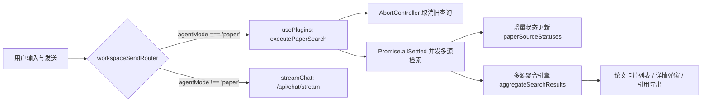

# 🏗️ 格至智能协同教育系统（93Gezhi）— 前后端功能架构指导

> **目标读者**：Claude、Codex 等 AI 编程助手
> **用途**：提供完整、精确的项目架构图谱，使 AI 无需全文搜索即可理解项目结构与功能边界，减少 Token 消耗
> **最后更新**：2026-09-03

---

## 目录

1. [项目概述](#1-项目概述)
2. [系统架构总览](#2-系统架构总览)
3. [后端架构（FastAPI）](#3-后端架构fastapi)
   - [3.1 技术栈与启动](#31-技术栈与启动)
   - [3.2 配置系统](#32-配置系统)
   - [3.3 数据库模型](#33-数据库模型)
   - [3.4 API 端点完全路由表](#34-api-端点完全路由表)
   - [3.5 服务层核心架构](#35-服务层核心架构)
   - [3.6 鉴权与中间件](#36-鉴权与中间件)
4. [前端架构（Vue 3 SPA）](#4-前端架构vue-3-spa)
   - [4.1 技术栈](#41-技术栈)
   - [4.2 页面路由与视图](#42-页面路由与视图)
   - [4.3 组件体系](#43-组件体系)
   - [4.4 状态管理（Hooks）](#44-状态管理hooks)
   - [4.5 API 调用层](#45-api-调用层)
   - [4.6 核心工具与配置](#46-核心工具与配置)
5. [AI 集成层](#5-ai-集成层)
   - [5.1 模型注册表](#51-模型注册表)
   - [5.2 智能体（Agent）系统](#52-智能体agent系统)
   - [5.3 Agent 工作流（LangGraph）](#53-agent-工作流langgraph)
   - [5.4 学习诊断系统](#54-学习诊断系统)
   - [5.5 外语训练系统](#55-外语训练系统)
   - [5.6 视觉引导图生成](#56-视觉引导图生成)
   - [5.7 RAGFlow 知识库集成](#57-ragflow-知识库集成)
6. [数据存储策略](#6-数据存储策略)
7. [关键业务流程](#7-关键业务流程)
8. [部署架构与启动方式](#8-部署架构与启动方式)
   - 8.1 生产部署架构
   - 8.2 本地开发启动（后端/前端/RAGFlow/Gitea 完整命令）
   - 8.3 常用运维命令
   - 8.4 部署注意事项
9. [真实学术论文查询系统架构（Paper Search System）](#9-真实学术论文查询系统架构paper-search-system)
   - 9.1 系统概述与真实性铁律
   - 9.2 前端分流路由与交互架构
   - 9.3 后端薄代理层设计
   - 9.4 Europe PMC 直连选型与设计边界
   - 9.5 多源聚合与确定性去重（RRF）
   - 9.6 引用生成与导出引擎（BibTeX / RIS）
   - 9.7 端口规范与外网依赖白名单
   - 9.8 自动化验证与质量保障矩阵


---

## 1. 项目概述

**格至（Gezhi）智能协同教育系统** 是一个面向高校计算机教育的 AI 辅助学习平台，提供：

- **学生端**：AI 对话式学习、编程实战、排位竞赛、考试中心、作业提交与诊断、错题本、课程库、学习诊断、知识图谱、外语训练（阅读/写作/口语/词汇）、学术论坛与代码仓库
- **教师端**：学情分析仪表盘、作业管理、考试管理、AI 备课、学习诊断审查、学术空间管理、项目管理、课程库管理

**目录结构**（`/Intelligence-Competition--`）：

```
├── backend/          # FastAPI 后端 (Python 3.10+)
│   ├── app/
│   │   ├── main.py           # 入口
│   │   ├── core/             # 配置、数据库、安全、初始化
│   │   ├── api/              # 路由入口 + 端点 + 鉴权依赖
│   │   │   ├── api.py        # 路由聚合
│   │   │   ├── deps.py       # 鉴权依赖注入
│   │   │   └── endpoints/    # 22 个端点模块
│   │   ├── models/           # 11 个 SQLAlchemy ORM 模型（10 个文件）
│   │   ├── schemas/          # Pydantic 请求/响应模型
│   │   ├── services/         # 业务逻辑层
│   │   │   ├── learning_diagnosis/  # 学习诊断子系统（24个文件）
│   │   │   └── teacher_lesson_prep/ # AI备课子系统（4个文件）
│   │   ├── repositories/     # 数据存储层（JsonStore）
│   │   └── tools/            # LangChain 工具
│   ├── scripts/              # 数据注入脚本
│   └── tests/                # 测试
├── frontend/         # Vue 3 SPA (原生 ESM)
│   ├── index.html            # 主应用入口 (5546行, 单页所有视图)
│   ├── login/index.html      # React 登录页 (Vite 构建产物)
│   ├── js/
│   │   ├── main.js           # Vue 3 应用入口 + 组件注册 + 状态绑定
│   │   ├── api/              # 19 个 API 模块
│   │   ├── components/       # 40 个 Vue 组件（33 根目录 + 7 外语）
│   │   ├── hooks/            # 13 个组合式函数
│   │   ├── config/           # 环境配置 + 模型列表 + 图表配置
│   │   ├── utils/            # 工具函数
│   │   └── data/             # 静态数据 (文章、题目、mock数据)
│   └── 登录页/               # React 登录页源码 (Vite + shadcn/ui)
├── ragflow/          # RAGFlow 知识库引擎 Docker 编排
└── 数据库资料/        # 数据库导出与迁移脚本
```

---

## 2. 系统架构总览

**总体架构**：单体后端 + 单体前端 + 多 AI 服务集成。

```
┌─────────────────────────────────────────────────────────────────────┐
│                         前端（Vue 3 SPA，无构建工具）                    │
│  index.html (单页所有视图, currentView 状态机)                         │
│  ├── js/main.js ── 13 个 Hooks（useAuth/useChat/useDashboard...）      │
│  ├── js/components/ ── 40 个 Vue 组件（学生端/教师端/图表/外语）          │
│  └── js/api/ ── 19 个 API 模块 → utils/request.js（fetch 封装+JWT）      │
└──────────────┬──────────────────────────────────────────────────────┘
               │ HTTP /api（Bearer JWT）+ SSE 流式
┌──────────────▼──────────────────────────────────────────────────────┐
│                     后端（FastAPI + SQLAlchemy）                       │
│  main.py → api/api.py → 22 个 endpoints 模块                          │
│  ├── 认证层：get_auth_payload / require_teacher / ensure_self_or_teacher│
│  ├── 业务层：services/（JsonStore 通用存储 + 各业务服务）                 │
│  └── 数据层：domain_records（JsonStore 主存储）+ 10 张 ORM 表            │
└───────┬──────────────┬────────────────────┬─────────────────────────┘
        │              │                    │
   ┌────▼─────┐   ┌────▼──────┐   ┌────────▼─────────┐
   │  MySQL    │   │  RAGFlow  │   │  外部 AI 服务      │
   │ Software_ │   │  知识库引擎 │   │ 阿里云百炼（文本/    │
   │  Cup      │   │  数据集+检索 │   │  图像/omni 语音）    │
   └──────────┘   └───────────┘   │ 智谱 GLM（备课）     │
                                  │ Gitea（代码仓库）     │
                                  └────────────────────┘
```

**数据流核心模式**：
1. **认证流**：React 登录页 → `/api/student|teacher/login` → JWT → localStorage → Vue SPA 守卫
2. **AI 对话流**：`/api/chat/stream`（SSE）→ LangGraph 多 Agent 工作流或 RAG 检索 → 流式返回
3. **学习证据流**：考试/作业/排位提交 → `publish_learning_activity_safely()` → 学习诊断证据 → 快照重算
4. **存储流**：大部分业务数据经 `JsonStore`（domain_records 表 payload JSON 列），结构化数据用 ORM 表

---

## 3. 后端架构（FastAPI）

### 3.1 技术栈与启动

- **框架**: FastAPI (title="AI Private Tutor Backend", version="3.0")
- **ORM**: SQLAlchemy (declarative base)
- **数据库**: MySQL 8.0 (`Software_Cup` 数据库)
- **AI 框架**: LangChain + LangGraph (Agent 工作流)
- **认证**: 自定义 JWT (HMAC-SHA256, 无第三方库依赖)
- **启动方式**: `uvicorn app.main:app --host 0.0.0.0 --port 8516` (或 9516 用于开发)
- **端口**: 8516（生产）/ 9516（开发，避免 Windows 保留端口 8516）

**入口文件**: `backend/app/main.py`

```python
app = FastAPI(title="AI Private Tutor Backend", version="3.0")
app.include_router(api_router, prefix="/api")
# CORS: 允许 localhost:5173/5174/3000 + gezhisystem.com
# 挂载 /static 目录供文件访问
```

### 3.2 配置系统

**环境变量**: 通过 `backend/.env` 文件加载，`app/core/config.py` 中的 `Settings` 类定义。

| 配置组 | 关键变量 | 说明 |
|--------|---------|------|
| **服务器** | `BACKEND_PORT=8516`, `ENVIRONMENT`, `APP_SECRET_KEY` | 服务端口、环境、JWT密钥 |
| **数据库** | `DB_HOST/DB_PORT/DB_USER/DB_PASS/DB_NAME` | MySQL 连接，默认 `127.0.0.1:3306` |
| **RAGFlow** | `RAGFLOW_API_KEY/BASE_URL/AGENT_ID/CHAT_ID/DATASET_ID` | 知识库引擎 |
| **LLM (阿里云百炼)** | `OPENAI_API_KEY`, `OPENAI_API_BASE` | 主模型 API Key |
| **LLM (智谱)** | `AI_LESSON_PREP_API_KEY`, `ZHIPU_MODEL_API_KEY` | 备课/课件相关 |
| **全模态 Omni** | `QWEN_OMNI_API_KEY` | 口语评测专用，可回退到 `OPENAI_API_KEY` |
| **图片生成** | `QWEN_IMAGE_ENABLED/API_KEY/BASE_URL/MODEL` | 阿里云通义万相 |
| **SMS (阿里云)** | `ALIYUN_SMS_*` | 短信验证码（默认 Mock 模式） |
| **Gitea** | `GITEA_ENABLED/BASE_URL/API_TOKEN/ORG` | 代码仓库集成 |

### 3.3 数据库模型

**11 个 SQLAlchemy 模型**（10 个文件，`user_knowledge.py` 内含 2 个模型），全部在 `backend/app/models/` 中：

| 模型 | 表名 | 主键 | 用途 |
|------|------|------|------|
| `UserAccount` | `user_accounts` | `username` (String) | 用户账户：username, role(student/teacher), password_hash, phone, real_name, student_id, teacher_id, class_name, avatar_path |
| `StudentProfile` | `student_profiles` | `user_id` | 学生画像：knowledge(0-100), cognitive, pace, error_pattern, goal, background |
| `ChatMessage` | `chat_messages` | `id` (auto) | 聊天消息：user_id, agent_mode, role, content, sender_id, 复合索引(user_id, agent_mode, created_at) |
| `DomainRecord` | `domain_records` | `id` (auto) | **通用 JSON 存储表**（核心存储机制）：module, record_type, record_key, owner_id, role, status, payload(Text/JSON) |
| `UserRagMapping` | `user_rag_mappings` | `user_id` | 用户 RAGFlow 数据集映射 |
| `UserKnowledgeRepository` | `user_knowledge_repositories` | `id` (String) | 用户知识库：user_id, name, 唯一约束(user_id, name) |
| `UserKnowledgeDocument` | `user_knowledge_documents` | `id` (String) | 用户知识文档：user_id, repository_id, dataset_id, rag_document_id, filename, file_size, status |
| `RankedQuestion` | `ranked_questions` | `id` (auto) | 排位竞赛题目：question_id, title, difficulty, min_tier, category, description, input_format, output_format, score_reward, score_penalty, time_limit_sec |
| `GiteaAccountBinding` | `gitea_account_bindings` | `campus_user_id` | Gitea 账号绑定：gitea_user_id, gitea_username, gitea_email, token_last_four, sync_status |
| `SmsVerificationCode` | `sms_verification_codes` | `id` (auto) | 短信验证码：phone, purpose, code_hash, expires_at, attempts |
| `CodeDiagnosis` | `code_diagnoses` | `id` (auto) | 代码诊断记录：user_id, problem_id, problem_title, user_code, diagnosis_result |

### 3.4 API 端点完全路由表

所有路由挂载于 `/api` 前缀下。认证方式分为三种：
- `无认证` — 公开端点（如 `/ai/models`）
- `Depends(get_auth_payload)` — 要求有效 JWT Bearer token，从 `Authorization` 头获取
- `Depends(require_teacher)` — 要求教师角色
- `ensure_self_or_teacher(user_id, payload)` — 仅本人或教师可访问

#### 3.4.1 认证模块 — `auth.py`

| 方法 | 路由 | 认证 | 请求体 | 说明 |
|------|------|------|--------|------|
| POST | `/api/sms/send-code` | 无 | `{phone, purpose("register"\|"login"), role}` | 发送短信验证码（Mock 模式返回 code） |
| POST | `/api/student/register` | 无 | `{password, phone, real_name, student_id, class_name, sms_code, ...}` | 学生注册：校验学号/手机号唯一性 |
| POST | `/api/student/login` | 无 | `{username, password, role="student"}` | 学生密码登录，返回 JWT token + user 对象 |
| POST | `/api/student/mobile-login` | 无 | `{phone, sms_code, role="student"}` | 学生手机号验证码登录 |
| POST | `/api/teacher/register` | 无 | `{username, password, teacher_id, ...}` | 教师注册 |
| POST | `/api/teacher/login` | 无 | `{username, password, role="teacher"}` | 教师密码登录 |
| POST | `/api/teacher/mobile-login` | 无 | `{phone, sms_code, role="teacher"}` | 教师手机号登录 |
| GET | `/api/auth/me` | Bearer | — | 获取当前登录用户信息 |

**返回值格式**: `{success: true/false, message: "...", data: {token, user: {username, role, realName, phone, avatarUrl, studentId, teacherId, className, gitea: {username, email, syncStatus, tokenLastFour}}}}`

**密码哈希**: PBKDF2-SHA256，格式 `pbkdf2_sha256$salt$digest`

#### 3.4.2 智能体模块 — `agents.py`

| 方法 | 路由 | 认证 | 说明 |
|------|------|------|------|
| GET | `/api/agents` | 无 | 获取所有智能体配置（默认 + 自定义覆盖，合并后返回） |
| PUT | `/api/agents/{agent_id}` | 无 | 保存智能体配置（覆盖默认，存入 JsonStore agents:config） |
| DELETE | `/api/agents/{agent_id}` | 无 | 删除智能体（默认 agent 设为 isActive=false，自定义的删除） |

**数据存储**: `JsonStore(module="agents", record_type="config")` + `get_default_agents()` 合并。

#### 3.4.3 聊天模块 — `chat.py`（核心模块）

| 方法 | 路由 | 认证 | 说明 |
|------|------|------|------|
| GET | `/api/ai/models` | 无 | 列出所有可用 AI 模型（按 text/image/omni 分类） |
| POST | `/api/user/upload` | 无 | 用户上传文件到个人知识库（FormData: user_id, file） |
| POST | `/api/chat` | 无 | 非流式聊天（支持 RAG / 多Agent / 代码诊断） |
| POST | `/api/chat/stream` | **Bearer 强制** | **SSE 流式聊天**（核心端点） |
| GET | `/api/chat/history` | 无 | 获取聊天历史 (session_id, agent_mode, limit) |
| DELETE | `/api/chat/history/{message_id}` | 无 | 删除单条聊天记录 |
| DELETE | `/api/chat/history` | 无 | 清空聊天历史 |
| GET | `/api/diagnosis/history` | 无 | 获取代码诊断历史 (user_id) |
| GET | `/api/v1/models` | 无 | OpenAI 兼容模型列表 |
| POST | `/api/v1/chat/completions` | 无 | **OpenAI 兼容接口**（支持流式） |

**`/chat/stream` SSE 协议**：
- `data: {"type": "token", "content": "..."}` — 文本块
- `data: {"type": "progress", "agent": "Alina"/"CodeNinja"/"PaperBot"/"DataBot", "status": "..."}` — Agent 状态
- `data: {"type": "progress_end", "agent": "..."}` — 工具执行完毕
- `data: {"type": "model_unavailable", "model": "...", "message": "..."}` — 模型不可用
- `data: {"type": "error", "message": "..."}` — 错误
- `data: {"type": "complete"}` — 流结束

**Agent 模式路由**：
- `tutor`（默认）— 引导式学习，LangGraph 多Agent 工作流
- `rag` — 强制知识库检索（不走 LangGraph，直接调用模型 + RAGFlow）
- `chat` — 普通 AI 对话
- `paper` — 学术论文查询

**代码诊断**：当 `is_diagnosis=true` 或消息含 `【用户当前代码】` 时，自动触发 `agent_coder` 并保存诊断记录到 `CodeDiagnosis` 表。

#### 3.4.4 用户画像模块 — `profile.py`

| 方法 | 路由 | 认证 | 说明 |
|------|------|------|------|
| GET | `/api/profile/summary` | Bearer | 获取用户画像摘要 (knowledgeScore, paceScore, cognitiveStyle, goal, level) |
| GET | `/api/profile/trends` | Bearer | 获取学习趋势 (7d/30d 知识得分与步调曲线) |
| GET | `/api/profile/knowledge-map` | Bearer | 获取知识图谱树 (rootId, depth, mastery 数据) |
| GET | `/api/profile/{user_id}` | Bearer | 获取完整用户画像 |
| POST | `/api/profile/update` | Bearer | 更新画像 (knowledge, cognitive, pace, error_pattern, goal, background) |
| POST | `/api/profile/record_test` | Bearer | 记录测试结果（自动更新 knowledge/pace 分数） |

#### 3.4.5 排位竞赛模块 — `ranked.py`

| 方法 | 路由 | 认证 | 说明 |
|------|------|------|------|
| GET | `/api/ranked/student/{user_id}/dashboard` | Bearer | 排位赛首页：玩家档案、排行榜、每日挑战、规则、段位天梯 |
| GET | `/api/ranked/student/{user_id}/history` | Bearer | 对战历史列表 |
| GET | `/api/ranked/student/{user_id}/mistakes` | Bearer | 排位错题列表 |
| GET | `/api/ranked/student/{user_id}/seasons` | Bearer | 赛季记录 |
| GET | `/api/ranked/questions` | 无 | 排位题库列表（支持 difficulty/min_tier 过滤） |
| GET | `/api/ranked/questions/{question_id}` | 无 | 单题详情 |
| POST | `/api/ranked/matches/start` | Bearer | 开始匹配（按段位难度随机选题） |
| POST | `/api/ranked/matches/{match_id}/submit` | Bearer | 提交对战结果（含结算逻辑：积分/段位/连胜/错题） |
| PATCH | `/api/ranked/mistakes/{mistake_id}` | Bearer | 更新错题状态 |
| DELETE | `/api/ranked/mistakes/{mistake_id}` | Bearer | 删除错题 |
| POST | `/api/ranked/coach/ask` | Bearer | 向排位 AI 教练提问 |
| POST | `/api/ranked/mistakes/{mistake_id}/ai-analysis` | Bearer | AI 错题分析 |

**数据存储**: `JsonStore(module="ranked")` — profile, leaderboard, daily_challenge, rules, tier_ladder, match, mistake, season

**结算逻辑**：`win` → 加积分 + 连胜计数；`loss` → 扣积分 + 中断连胜；`cheat_lose` → 大额扣分。段位青铜→白银(800)→黄金(1600)→铂金(2600)→钻石(3800)→王者(5200)。

#### 3.4.6 作业模块 — `homework.py`

| 方法 | 路由 | 认证 | 说明 |
|------|------|------|------|
| GET | `/api/homework/student/list` | Bearer | 学生作业列表（含提交状态/成绩/诊断） |
| GET | `/api/homework/teacher/overview` | 无 | 教师作业总览（含提交率、平均分、错题统计、思路族谱） |
| GET | `/api/homework/teacher/submissions` | 无 | 作业提交详情 (homeworkId) |
| GET | `/api/homework/teacher/analysis` | 无 | 作业分析报告 (homeworkId) |
| POST | `/api/homework/teacher/report` | 无 | 生成 AI 作业报告（含教师建议、分层建议） |
| POST | `/api/homework/attempts/{attempt_id}/grade` | 无 | 教师批改作业 |
| POST | `/api/homework` | 无 | 创建作业（支持 AI 画布 blocks → questions 转换） |
| GET | `/api/homework/{homework_id}` | 无 | 作业详情 |
| POST | `/api/homework/{homework_id}/submit` | Bearer | 提交作业（含答案/文件） |
| POST | `/api/homework/{homework_id}/diagnose` | 无 | AI 作业诊断（三维度：Alina/CodeNinja/Prof.X） |

**作业类型**：`choice`(选择题)、`blank`(填空)、`programming`(编程)、`text`(文档)
**数据存储**: `JsonStore(module="homework")` — homework, submission, diagnosis

#### 3.4.7 考试模块 — `exams.py`

| 方法 | 路由 | 认证 | 说明 |
|------|------|------|------|
| GET | `/api/exams/student/{user_id}/overview` | Bearer | 学生考试概览（upcoming/active/completed，含编程题标记） |
| GET | `/api/exams/teacher/dashboard` | 教师 | 教师考试仪表盘（含异常提交监控） |
| GET | `/api/exams/teacher/error-analysis` | 教师 | 错题分析（按知识标签聚合） |
| GET | `/api/exams/questions/{question_id}/wrong-students` | 教师 | 题目错题学生列表 |
| POST | `/api/exams/questions/{question_id}/review-task` | 教师 | 创建讲评任务 |
| POST | `/api/exams` | 教师 | 创建考试（含客观题 + 编程题） |
| GET | `/api/exams/{exam_id}` | Bearer | 考试详情 |
| POST | `/api/exams/{exam_id}/attempts` | Bearer | 开始考试（创建答题记录） |
| PUT | `/api/exams/attempts/{attempt_id}/answers` | Bearer | 保存答题答案（含时间校验） |
| POST | `/api/exams/attempts/{attempt_id}/submit` | Bearer | 提交考试（自动判分 + 生成错题记录） |
| POST | `/api/exams/{exam_id}/programming-problems` | 教师 | 添加编程题 |
| GET | `/api/exams/{exam_id}/submissions` | 教师 | 获取考试提交列表 |
| POST | `/api/exams/attempts/{attempt_id}/judge-programming` | Bearer | 编程题自动评测（CodeSandbox） |
| GET | `/api/exams/student/{user_id}/mistakes` | Bearer | 学生错题本（含 AI 分析状态） |
| GET | `/api/exams/student/{user_id}/review-tasks` | Bearer | 学生讲评任务列表 |
| PATCH | `/api/exams/{exam_id}/status` | 教师 | 考试状态管理（draft→scheduled→running→completed，允许回退如 scheduled→draft、running→scheduled、completed→running） |
| POST | `/api/exams/mistakes` | Bearer | 手动创建错题记录 |
| POST | `/api/exams/mistakes/{mistake_id}/ai-analysis` | Bearer | AI 错因分析（调用 LLM 生成诊断/concept/practice/path） |
| PATCH | `/api/exams/mistakes/{mistake_id}` | Bearer | 更新错题（标记 mastered 等） |

**数据存储**: `JsonStore(module="exams")` — exam, attempt, mistake, review_task

#### 3.4.8 论坛模块 — `forum.py`

| 方法 | 路由 | 认证 | 说明 |
|------|------|------|------|
| GET | `/api/forum/posts` | 无 | 获取所有帖子 |
| GET | `/api/forum/unanswered-qna` | 无 | 获取未答疑的 Q&A 帖子 |
| POST | `/api/forum/posts` | Bearer | 创建帖子 |
| POST | `/api/forum/posts/{post_id}/replies` | Bearer | 回复帖子（AI 回复自动记录日志） |
| DELETE | `/api/forum/posts/{post_id}` | Bearer | 删除帖子 |
| PUT | `/api/forum/posts/{post_id}/pin` | Bearer | 置顶/取消置顶 |
| PUT | `/api/forum/posts/{post_id}/like` | Bearer | 点赞帖子 |
| PUT | `/api/forum/posts/{post_id}/replies/{reply_id}/like` | Bearer | 点赞回复 |
| PUT | `/api/forum/posts/{post_id}/view` | 无 | 增加浏览量 |
| GET | `/api/forum/announcements` | 无 | 获取公告列表 |
| POST | `/api/forum/announcements` | Bearer | 发布公告 |
| GET | `/api/forum/hottopics` | 无 | 获取热门话题 |
| POST | `/api/forum/hottopics` | Bearer | 添加热门话题 |
| PUT | `/api/forum/hottopics/weight` | Bearer | 调整话题权重 |
| DELETE | `/api/forum/hottopics` | Bearer | 删除话题 |
| GET | `/api/forum/ai-replies/logs` | 无 | AI 回复日志 |
| PUT | `/api/forum/ai-replies/logs/{log_id}` | Bearer | 审核 AI 回复 |

**数据存储**: `JsonStore(module="forum")` — post, announcement, hot_topic, ai_reply_log

#### 3.4.9 代码仓库模块 — `code_repository.py`

| 方法 | 路由 | 认证 | 说明 |
|------|------|------|------|
| GET | `/api/code-repositories` | 可选 | 仓库列表（支持 q/language/tag/sort 过滤） |
| POST | `/api/code-repositories` | 可选 | 发布仓库（创建 Gitea 仓库 + 同步到平台） |
| GET | `/api/code-repositories/reports` | 无 | 举报列表 |
| GET | `/api/code-repositories/{project_id}` | 可选 | 仓库详情 |
| GET | `/api/code-repositories/{project_id}/download` | 无 | 下载仓库（返回 Gitea 归档 URL/下载信息） |
| GET | `/api/code-repositories/{project_id}/tree` | 无 | 文件树 |
| GET | `/api/code-repositories/{project_id}/blob` | 无 | 文件内容 |
| GET | `/api/code-repositories/{project_id}/languages` | 无 | 语言统计 |
| POST | `/api/code-repositories/{project_id}/star` | 可选 | 点赞/取消点赞 |
| POST | `/api/code-repositories/{project_id}/favorite` | 可选 | 收藏/取消收藏 |
| POST | `/api/code-repositories/{project_id}/reports` | 可选 | 举报仓库 |
| PUT | `/api/code-repositories/reports/{report_id}` | 可选 | 审核举报 |
| DELETE | `/api/code-repositories/{project_id}` | 可选 | 删除仓库 |
| POST | `/api/code-repositories/{project_id}/webhooks/gitea` | 签名 | Gitea Webhook 回调 |
| GET | `/api/users/{user_id}/code-repositories` | 无 | 用户仓库统计 |

#### 3.4.10 Gitea 账号模块 — `gitea_accounts.py`

| 方法 | 路由 | 认证 | 说明 |
|------|------|------|------|
| GET | `/api/gitea/me` | Bearer | 获取 Gitea 绑定信息 |
| POST | `/api/gitea/token` | Bearer | 刷新 Gitea 令牌 |

#### 3.4.11 团队 Git 模块 — `team_git.py`

| 方法 | 路由 | 认证 | 说明 |
|------|------|------|------|
| GET | `/api/team-git/gitea-health` | 无 | Gitea 服务健康检查 |
| GET | `/api/team-git/projects` | 可选 | 项目列表 |
| POST | `/api/team-git/projects` | 可选 | 创建项目 |
| DELETE | `/api/team-git/projects/{project_id}` | 可选 | 删除项目 |
| GET | `/api/team-git/projects/{project_id}` | 可选 | 项目详情 |
| GET | `/api/team-git/projects/{project_id}/repository-home` | 可选 | 仓库首页 |
| GET | `/api/team-git/projects/{project_id}/tree` | 可选 | 文件树 |
| GET | `/api/team-git/projects/{project_id}/branches` | 可选 | 分支列表 |
| GET | `/api/team-git/projects/{project_id}/blob` | 可选 | 文件内容 |
| GET | `/api/team-git/projects/{project_id}/languages` | 可选 | 语言统计 |
| PUT | `/api/team-git/projects/{project_id}/repository-feedback` | 可选 | 仓库反馈 |
| GET | `/api/team-git/members/search` | 可选 | 搜索成员 |
| PATCH | `/api/team-git/projects/{project_id}` | 可选 | 更新项目 |
| POST | `/api/team-git/projects/{project_id}/repository` | 可选 | 创建仓库 |
| POST | `/api/team-git/projects/{project_id}/repository/bind` | 可选 | 绑定仓库 |
| POST | `/api/team-git/projects/{project_id}/tasks` | 可选 | 分配任务 |
| POST | `/api/team-git/projects/{project_id}/reminders` | 可选 | 发送提醒 |
| POST | `/api/team-git/projects/{project_id}/clone-confirmation` | 可选 | 克隆确认 |
| POST | `/api/team-git/projects/{project_id}/refresh` | 可选 | 刷新仓库 |
| POST | `/api/team-git/projects/{project_id}/pull-requests/{pr_number}/review` | 可选 | PR 评审 |
| POST | `/api/team-git/projects/{project_id}/contribution-evaluation` | 可选 | 贡献评估 |

#### 3.4.12 学情分析模块 — `analytics.py`

**说明**：教师端学情分析看板（最大端点文件，1167 行）。六维雷达 + 班级概览 + AI 干预建议。

**六维雷达指标**（`_compute_radar_values`）：
1. **规划一致性** — Alina 诊断均值（否则画像 pace）
2. **代码质量与工程** — CodeNinja 均值 × 0.7 + 编程考试分 × 0.3
3. **理论逻辑完备度** — Prof.X 均值 + 客观题得分率均值
4. **学术论坛活跃度** — 发帖 +10、回帖 +5（上限 100）
5. **专注度** — 0.6 × pace + 0.4 × 错题代理（100 - 未掌握错题×5 - 重复错题×8）
6. **Checkpoint 完成率** — 仅 daily 作业的提交/批改占比 × 100

| 方法 | 路由 | 认证 | 说明 |
|------|------|------|------|
| GET | `/api/analytics/overview` | 教师 | 学情总览（雷达指标、班级均值、周活跃、24h 热力、薄弱点、建议、行动队列、互动） |
| GET | `/api/analytics/students` | 教师 | 学生列表（含雷达值+证据） |
| GET | `/api/analytics/students/search` | 教师 | 搜索学生 `q`（精确/前缀/包含三级匹配） |
| GET | `/api/analytics/students/me` | Bearer | 学生个人雷达图 |
| GET | `/api/analytics/students/{student_id}` | Bearer | 学生详情（错题、雷达、时间线） |
| POST | `/api/analytics/students/{student_id}/nudge` | Bearer | 发送提醒 `{message}` |
| GET | `/api/analytics/advices` | 教师 | 干预建议列表 |
| GET | `/api/analytics/action-queue` | 教师 | 行动队列 |
| GET | `/api/analytics/interactions` | 教师 | 互动记录 |
| POST | `/api/analytics/interactions` | 教师 | 创建互动（nudge 类型自动为每个目标学生建提醒） |
| PATCH | `/api/analytics/interactions/{record_id}` | 教师 | 更新互动（补发提醒时写入 dashboard/notification） |
| POST | `/api/analytics/dispatch` | 教师 | 派发干预任务 |
| POST | `/api/analytics/interactions/{record_id}/complete` | 教师 | 学生完成互动（去重检测：`interaction_completion` 记录） |
| POST | `/api/analytics/advices/generate` | 教师 | AI 生成干预建议（LLM + 3 条规则兜底） |
| POST | `/api/analytics/action-queue/generate` | 教师 | 规则引擎生成行动队列（高危督学/薄弱补弱/截止催交） |

#### 3.4.13 仪表盘模块 — `dashboard.py`

| 方法 | 路由 | 认证 | 说明 |
|------|------|------|------|
| GET | `/api/dashboard/student/{user_id}` | Bearer | 学生仪表盘（作业/考试截止日期、错题热力图、干预通知） |
| POST | `/api/dashboard/teacher/intervention` | 无 | 创建教师干预 |
| GET | `/api/dashboard/teacher/interventions` | 无 | 获取干预列表 |
| GET | `/api/dashboard/teacher/class-overview` | 无 | 班级总览 |
| GET | `/api/dashboard/student/{user_id}/interactions` | 无 | 学生互动记录 |

#### 3.4.14 学习诊断模块 — `learning_diagnosis.py`

**说明**：学生端学习诊断 API。所有端点要求 `Authorization: Bearer`，且校验 token 的 `sub` 与操作的 `student_id` 一致（否则 403）。诊断会话由 `DiagnosisWorkflow` 编排（见 5.4 节）。

| 方法 | 路由 | 请求体要点 | 说明 |
|------|------|-----------|------|
| POST | `/api/learning-diagnosis/sessions` | `{student_id, course, deadline, weekly_minutes(默认180), self_reported_difficulty, include_git_evidence, raw_goal_text, goal_text, course_id, course_name, reuse_existing_evidence}` | 创建诊断会话：解析目标→采集证据→生成快照+路径+任务 |
| POST | `/api/learning-diagnosis/sessions/{session_id}/goals` | 目标变更请求（同创建） | 变更目标→新建 GoalVersion→重新生成快照 |
| GET | `/api/learning-diagnosis/sessions/{session_id}` | query: `student_id` | 获取会话 + 最新快照 `{session, snapshot}` |
| GET | `/api/learning-diagnosis/latest` | query: `student_id` | 最新会话完整包 `{session, snapshot, path, evidence}` |
| POST | `/api/learning-diagnosis/sessions/{session_id}/refresh` | `{trigger: {trigger_type, sandbox_status, failure_count, include_git_evidence}}` | 重新生成快照；`SANDBOX_ERROR` 时直接返回当前状态 |
| GET | `/api/learning-diagnosis/sessions/{session_id}/path` | query: `student_id` | 路径历史 `{session_id, paths: [PathVersion]}` |
| POST | `/api/learning-diagnosis/tasks/{task_id}/hints` | `{requested_level(1-5), assessment_mode, attempt}` | 请求 LLM 提示；提示级别取 `min(current+1, 允许上限, requested)`；评估模式上限为 1 |
| POST | `/api/learning-diagnosis/tasks/{task_id}/submit` | `{student_id, session_id, code, answer, hint_level(0-5), assessment_mode}` | 提交答案：编程任务走沙箱+证据存储；文本任务规则评分+LLM 评分 |
| POST | `/api/learning-diagnosis/tasks/{task_id}/run` | `{student_id, session_id, code, language("python")}` | 代码预运行（不持久化，仅编程类任务） |
| POST | `/api/learning-diagnosis/sessions/{session_id}/git-evidence` | `{student_id, include_git_evidence}` | 开启后采集 Git 提交证据，并重新生成快照 |
| POST | `/api/learning-diagnosis/internal/activity` | 内部事件（source_module, content_type, content_id, attempt_id, result_payload, status, occurred_at） | 内部学习活动事件接入（考试/作业/排位旁路调用） |
| GET | `/api/learning-diagnosis/snapshots/{snapshot_id}` | query: `student_id` | 获取单次快照 |

#### 3.4.15 教师学习诊断审查 — `teacher_learning_diagnosis.py`

**说明**：教师端诊断审查控制台。所有端点要求教师角色（403 否则）。审查记录按 (snapshot_id, teacher_id) 维度存储。风险等级由规则计算（快照最低掌握度），非 LLM 判定。

**ReviewStatus**: `PENDING | REVIEWED | RISK_CONFIRMED | RISK_DISMISSED | OBSERVING`

| 方法 | 路由 | 认证 | 说明 |
|------|------|------|------|
| GET | `/api/teacher/learning-diagnosis/reviews` | 教师 | 审查列表（过滤 status/risk_level），含 review_state、notes_count、watch_flag |
| GET | `/api/teacher/learning-diagnosis/reviews/{snapshot_id}` | 教师 | 单次审查详情（snapshot + review_state + notes + watch_flag） |
| POST | `/api/teacher/learning-diagnosis/reviews/{snapshot_id}` | 教师 | 保存审查状态 `{status, comment, risk_level}` |
| PATCH | `/api/teacher/learning-diagnosis/reviews/{snapshot_id}/state` | 教师 | 保存审查状态（POST 的别名） |
| POST | `/api/teacher/learning-diagnosis/reviews/{snapshot_id}/notes` | 教师 | 添加审查备注 `{comment, note_type("general")}` |
| PUT | `/api/teacher/learning-diagnosis/watch-flags/{student_id}` | 教师 | 设置关注标记 `{pinned(true), reason}`，按 (student, teacher) upsert |
| DELETE | `/api/teacher/learning-diagnosis/watch-flags/{student_id}` | 教师 | 取消关注 |
| GET | `/api/teacher/learning-diagnosis/weak-points` | 教师 | 跨学生薄弱知识点聚合 |

#### 3.4.16 教师备课模块 — `teacher_lesson_prep.py`

**说明**：AI 备课中心。所有端点要求教师角色。请求体限制 256 KiB（`LimitedBodyRoute`，超出返回 413）。AI 客户端直连智谱 GLM（`glm-4.5-air`，`AI_LESSON_PREP_MODEL`），使用 JSON 输出模式 + 严格 Pydantic 校验 + 失败重试修复。

| 方法 | 路由 | 请求体要点 | 说明 |
|------|------|-----------|------|
| GET | `/api/teacher/lesson-prep/config` | — | 备课配置 `{model, ai_ready, max_input_tokens, max_output_tokens, supported_search_formats: ["pdf","pptx"]}` |
| GET | `/api/teacher/lesson-prep/resources` | query: `course, file_type, query` | 课件资源列表（`CoursewareCatalog` 扫描 `frontend/courses/` 目录，含 index_status） |
| POST | `/api/teacher/lesson-prep/search` | `{query(≤200), resource_ids(1-10), limit(1-50)}` | 课件内容检索（`DocumentRetriever` 分页 chunk 匹配） |
| POST | `/api/teacher/lesson-prep/summarize` | `{resource_ids, query}` | AI 总结课件：检索 top-8 → LLM 生成 `{content, key_points}` |
| POST | `/api/teacher/lesson-prep/generate` | `{topic, course_name, audience, duration_minutes(默认45), resource_ids, requirements}` | AI 生成教案：检索 top-10 → LLM 生成 `{title, objectives, key_points, difficulties, teaching_flow(分钟数总和须=课时), questions, exercises, homework}`；校验失败自动修复一次 |
| POST | `/api/teacher/lesson-prep/drafts` | `{draft_id(""=新建), title, topic, duration_minutes, resource_ids, content}` | 保存/更新草稿（JsonStore teacher_lesson_prep:draft） |
| GET | `/api/teacher/lesson-prep/drafts` | — | 草稿列表 |
| GET | `/api/teacher/lesson-prep/drafts/{draft_id}` | — | 草稿详情 |
| POST | `/api/teacher/lesson-prep/export-docx` | 教案完整内容 | 导出 DOCX 二进制（`Content-Disposition: attachment`，RFC 5987 文件名编码） |

#### 3.4.17 外语训练模块 — `language.py`

| 方法 | 路由 | 认证 | 说明 |
|------|------|------|------|
| POST | `/api/language/reading/analyze` | Bearer | 阅读理解分析（返回 JSON：level, keyVocabulary, complexSentences, summary, questions） |
| POST | `/api/language/vocabulary/explain` | Bearer | 词汇解释（返回 JSON：word, phonetic, meaning, examples） |
| POST | `/api/language/writing/analyze` | Bearer | 写作批改（三维度评分 + 逐句标注 + 混合评分） |
| POST | `/api/language/writing/optimize` | Bearer | 写作多维优化（两阶段重写） |
| POST | `/api/language/speaking/analyze` | Bearer | 口语评测（全模态 omni 模型，支持 read_aloud/free_speaking） |
| GET | `/api/language/wordbook` | Bearer | 生词本列表 |
| POST | `/api/language/wordbook` | Bearer | 添加单词 |
| PATCH | `/api/language/wordbook/{word}` | Bearer | 更新单词 |
| DELETE | `/api/language/wordbook/{word}` | Bearer | 删除单词 |
| POST | `/api/language/progress` | Bearer | 记录学习进度 |
| GET | `/api/language/overview` | Bearer | 学习总览（阅读/写作/口语/词汇统计） |
| GET | `/api/language/insights` | Bearer | 学习洞察（错误聚合） |
| GET | `/api/language/insights/advice` | Bearer | AI 生成学习建议 |
| GET | `/api/language/writing/history` | Bearer | 写作历史列表 |
| GET | `/api/language/writing/history/{record_id}` | Bearer | 写作批改详情 |
| DELETE | `/api/language/writing/history/{record_id}` | Bearer | 删除写作记录 |
| GET | `/api/language/reading/progress` | Bearer | 阅读进度 |
| POST | `/api/language/reading/progress` | Bearer | 标记文章已读 |
| DELETE | `/api/language/reading/progress/{article_id}` | Bearer | 取消已读标记 |
| GET | `/api/language/reading/user-articles` | Bearer | 用户导入文章列表 |
| POST | `/api/language/reading/user-articles` | Bearer | 导入文章（PDF/TXT） |
| PATCH | `/api/language/reading/user-articles/{record_id}` | Bearer | 重命名文章 |
| DELETE | `/api/language/reading/user-articles/{record_id}` | Bearer | 删除文章 |

**模型强制约束**：文本任务（阅读/写作/词汇）只允许 text 模型，口语任务只允许 omni 模型，混用返回 400。

#### 3.4.18 评测引擎模块 — `evaluator.py`

**说明**：测验/Checkpoint 评估系统，用于学生自测。**所有路由无认证**。响应格式使用 `api_response()`（`code: 0` 封装）和 `page_items` 分页。

| 方法 | 路由 | 说明 |
|------|------|------|
| GET | `/api/evaluator/quizzes` | 测验列表（过滤 tag/difficulty，支持 cursor 分页，自动 seed 默认测验） |
| POST | `/api/evaluator/attempts` | 创建答题尝试 `{quizId, userId("guest_user")}` |
| GET | `/api/evaluator/attempts/{attempt_id}` | 获取答题详情（含脱敏题目，不含正确答案） |
| POST | `/api/evaluator/attempts/{attempt_id}/submit` | 提交答案并评分 `{answers}`，`score = correctCount/total * 100` |
| GET | `/api/evaluator/attempts/{attempt_id}/result` | 获取评测结果 |

#### 3.4.19 日志模块 — `journal.py`

**说明**：学习成长档案事件系统。响应格式使用 `api_response()`（`code: 0` 封装）和 `page_items` 分页。

| 方法 | 路由 | 认证 | 说明 |
|------|------|------|------|
| POST | `/api/journal/events` | Bearer | 记录学习事件 `{type, title, summary, relatedIds, tags, scoreDelta, userId}` |
| GET | `/api/journal/events` | Bearer | 事件列表（过滤 type，支持 cursor 分页） |
| GET | `/api/journal/events/day` | Bearer | 按日期获取事件 `date=YYYY-MM-DD` |

#### 3.4.20 视觉引导图模块 — `visual_guide.py`

**说明**：AI 引导图生成（Mira 智能体）。无认证。概念图调用 Qwen 文生图模型，步骤图用文本模型生成结构化架构。

| 方法 | 路由 | 说明 |
|------|------|------|
| POST | `/api/visual-guide/generate` | 请求体 `{prompt, guide_type("concept"\|"steps"), session_id, style, context, image_model, text_model, agent_id, agent_prompt}`；响应 `{status, provider, svg, background_url/base64, caption, nodes, edges, metadata}`；图像生成失败时回退纯 SVG（`provider: "structured_svg"`） |

#### 3.4.21 用户中心模块 — `user_center.py`

**说明**：用户账户管理。所有路由使用 `get_auth_payload` + `ensure_self_or_teacher`。**注意**：`get_account_or_404` 不再为任意用户名静默创建账户（避免幽灵账号）。

| 方法 | 路由 | 说明 |
|------|------|------|
| GET | `/api/user/info/{username}` | 获取用户信息（含 Gitea 绑定摘要） |
| POST | `/api/user/update_info` | 更新资料 `{username, real_name(须含中文), student_id(4-20位数字), teacher_id, class_name, phone}` |
| POST | `/api/user/change_password` | 修改密码 `{username, old_password, new_password(≥6位)}` |
| POST | `/api/user/upload_avatar` | 上传头像（FormData：username + file，≤2MB，JPG/PNG/GIF/WebP，保存到 `static/avatars/`） |

#### 3.4.22 用户知识库模块 — `user_knowledge.py`

**说明**：个人 RAG 知识库管理。用户特定路由使用 `get_auth_payload` + `ensure_self_or_teacher`。

| 方法 | 路由 | 说明 |
|------|------|------|
| GET | `/api/user/knowledge` | 获取用户知识库列表（含仓库与文档，可同步远程 RAGFlow 状态） |
| GET | `/api/knowledge/courses` | 获取课程知识库列表（读 `RAGFLOW_COURSE_DATASETS` 配置） |
| POST | `/api/user/knowledge/repositories` | 创建知识库仓库 `{user_id, name}` |
| POST | `/api/user/knowledge/documents` | 上传文档（FormData：user_id + repository_id + file），上传到 RAGFlow 数据集并触发向量化 |
| POST | `/api/user/knowledge/upload` | 上传文档（`/documents` 的别名端点） |
| DELETE | `/api/user/knowledge/documents/{document_id}` | 删除文档（同时从 RAGFlow 移除） |
| DELETE | `/api/user/knowledge/repositories/{repository_id}` | 删除仓库及其全部文档 |

### 3.5 服务层核心架构

#### 3.5.1 通用数据存储：`JsonStore`（`repositories/json_store.py`）

**核心存储机制**：所有业务数据（作业、考试、论坛、排位等）统一存储在 `domain_records` 表中，通过 `module` + `record_type` + `record_key` 三元组定位。

```python
class JsonStore:
    def list_payloads(module, record_type, owner_id, status) -> list[dict]
    def get_payload(module, record_type, record_key, owner_id) -> dict | None
    def upsert(module, record_type, record_key, payload, owner_id, role, status) -> dict
    def create(module, record_type, payload, prefix, ...) -> dict
    def patch(module, record_type, record_key, patch, owner_id) -> dict | None
    def delete(module, record_type, record_key) -> bool
```

**模块映射**（`module` → `record_type` 列表）：

| module | record_types | 用途 |
|--------|-------------|------|
| `agents` | `config` | 智能体配置 |
| `ranked` | `profile`, `leaderboard`, `daily_challenge`, `rules`, `tier_ladder`, `match`, `mistake`, `season` | 排位赛 |
| `homework` | `homework`, `submission`, `diagnosis` | 作业 |
| `exams` | `exam`, `attempt`, `mistake`, `review_task` | 考试 |
| `forum` | `post`, `announcement`, `hot_topic`, `ai_reply_log` | 论坛 |
| `language` | `session`, `word`, `writing_history`, `article_read`, `user_article` | 外语 |
| `teacher_lesson_prep` | `draft` | 备课草稿 |
| `learning_diagnosis` | `session`, `goal_version`, `evidence`, `snapshot`, `path_version`, `task`, `hint`, `submission`, `watch_flag`, `content_association`, `activity_event`, `processing_receipt` | 学习诊断 |
| `dashboard` | `intervention`, `notification` | 仪表盘干预/通知 |
| `analytics` | `nudge`, `interaction`, `interaction_completion`, `advice`, `action` | 学情分析 |
| `evaluator` | `quiz`, `attempt` | 测验引擎 |
| `journal` | `event` | 学习日志 |
| `team_collaboration_git` | `project` | 团队 Git 项目 |

#### 3.5.2 代码沙箱：`CodeSandbox`（`services/code_sandbox.py`）

- 支持 Python 和 JavaScript 代码执行
- 双层安全检测：字符串模式匹配 + AST 分析
- 子进程隔离执行，超时 5 秒，输出限制 1MB
- 支持多种比较模式：exact, tolerance, ignore_case, ignore_ws

#### 3.5.3 AI 备课服务：`TeacherLessonPrepService`（`services/teacher_lesson_prep/service.py`）

- 通过 `CoursewareCatalog` 扫描前端 `courses/` 目录下的课件（PDF/PPTX）
- 通过 `DocumentRetriever` 对课件内容进行检索
- 通过 `LessonPrepAIClient` 调用智谱 GLM 模型进行总结/教案生成
- 支持导出为 DOCX 格式

#### 3.5.4 学习诊断服务：`DiagnosisWorkflow`（`services/learning_diagnosis/workflow.py`）

详见 [5.4 学习诊断系统](#54-学习诊断系统)。

### 3.6 鉴权与中间件

**JWT Token**：自定义 HMAC-SHA256 实现，7 天有效期，payload 包含 `sub`(username) 和 `role`。

**鉴权依赖**（`api/deps.py`）：
- `get_auth_payload` — 从 `Authorization: Bearer <token>` 解码 JWT，注入 payload dict
- `require_teacher` — 在 `get_auth_payload` 基础上校验 `role == "teacher"`
- `ensure_self_or_teacher(user_id, payload)` — 校验目标用户：仅本人或教师可访问

**小程序支持**：通过 `X-Gezhi-Client` 头识别小程序客户端，返回值格式切换为 `api_response(data)`。

---

## 4. 前端架构（Vue 3 SPA）

### 4.1 技术栈

- **框架**: Vue 3 (ESM, 本地导入 `libs/vue.esm-browser.js`)
- **样式**: Tailwind CSS (本地 `libs/tailwindcss.js`)，自定义配置
- **图标**: Phosphor Icons (本地 `libs/phosphor.js`)
- **图表**: ECharts (本地 `libs/echarts.min.js`)
- **Markdown**: marked.js + DOMPurify
- **代码编辑器**: Monaco Editor (CDN `0.39.0`)
- **Mermaid**: 图表渲染 (CDN `11.16.1`，暗色主题)
- **动画**: GSAP (CDN)
- **生成艺术**: p5.js (本地)
- **无构建工具** — 纯 ESM 运行，无 Webpack/Vite

### 4.2 页面路由与视图

**无传统路由器**，导航通过 `auth.currentView` 响应式变量控制，使用 `v-if`/`v-show` 切换视图。

**登录守卫**：`index.html` 内联脚本检查 `localStorage.isLoggedIn !== 'true'` → 重定向到 `./login/index.html`

**登录页**：独立的 React 应用（`登录页/` 目录，Vite + shadcn/ui），通过 API 登录后写 localStorage，然后跳回 `index.html`

**学生视图**（13 个）：

| 视图 ID | 组件 | 说明 |
|---------|------|------|
| `dashboard` | 内联模板 | 仪表盘：学习总览、截止日期、热力图、AI 建议 |
| `pathway` | 内联模板 | 知识图谱树 |
| `workspace` | 内联模板（核心） | 一站式工作台：多模式聊天 + 插件市场 + 任务管理 |
| `learning-diagnosis` | `<student-learning-diagnosis>` | 学习诊断 |
| `knowledge` | 内联模板 | 知识库管理 |
| `coding` | `<coding-sandbox>` | 编程实战 |
| `academic-space` | `<student-academic-space>` | 学术空间 |
| `foreign-lang` | `<foreign-lang-page>` | 外语学习工作台 |
| `mistakes` | `<student-mistake-book>` | 错题本 |
| `exam` | `<student-exam-center>` | 考试中心 |
| `homework` | `<student-homework>` | 作业 |
| `courses` | 内联模板 | 课程库 |
| `agents` | 内联模板 | 智能体编排工坊 |

**教师视图**（10 个）：

| 视图 ID | 组件 | 说明 |
|---------|------|------|
| `t_dashboard` | `<teacher-dashboard>` | 教师工作台 |
| `t_monitor` | 内联模板 | 班级监控 |
| `t_analytics` | `<teacher-analytics-center>` | 学情分析 |
| `t_diagnosis_review` | `<teacher-learning-diagnosis-review>` | 诊断审查 |
| `t_exams` | `<teacher-exam-manager>` | 考试管理 |
| `t_homework` | `<teacher-homework>` | 作业管理 |
| `t_projects` | `<teacher-project-manager>` | 项目管理 |
| `t_space` | `<teacher-space-manager>` | 空间管理 |
| `t_courses` | `<teacher-course-manager>` | 课程库管理 |
| `t_lesson_prep` | `<teacher-ai-lesson-prep>` | AI 备课 |

### 4.3 组件体系

**`js/components/`** 目录下 **40 个 Vue 组件**（33 个根目录 + 7 个 `foreign-lang/` 子目录）。所有组件使用 Vue 3 Options API + 内联模板（图表组件用 Composition API `defineComponent` + `h()` 渲染函数）。样式采用 Tailwind + 自定义 scoped CSS。

**学生端核心组件**：

| 组件标签 | 文件 | 用途 |
|---------|------|------|
| `student-learning-diagnosis` | `StudentLearningDiagnosis.js` | 学习诊断首页（编排器，动态切换子页） |
| `learning-diagnosis-task-page` | `LearningDiagnosisTaskPage.js` | 诊断任务页 |
| `learning-diagnosis-goal-modal` | `LearningDiagnosisGoalModal.js` | 目标设置弹窗（course_name, weekly_minutes, deadline, difficulty, reuse_existing_evidence） |
| `learning-diagnosis-evidence-modal` | `LearningDiagnosisEvidenceModal.js` | 证据来源详情弹窗 |
| `learning-diagnosis-metric-detail` | `LearningDiagnosisMetricDetail.js` | 指标详情弹窗 |
| `learning-diagnosis-version-page` | `LearningDiagnosisVersionPage.js` | 路径版本对比页（diff 计算） |
| `learning-knowledge-review-page` | `LearningKnowledgeReviewPage.js` | 知识点复习（包装 `LearningTextTaskWorkspace`） |
| `learning-guided-practice-page` | `LearningGuidedPracticePage.js` | 引导式练习（包装 `LearningTextTaskWorkspace`） |
| `learning-coding-practice-page` | `LearningCodingPracticePage.js` | 编程实践（Monaco 编辑器 + 沙箱运行 + 提示面板） |
| `learning-independent-retest-page` | `LearningIndependentRetestPage.js` | 独立复测（无提示，3 种场景类型） |
| `learning-text-task-workspace` | `LearningTextTaskWorkspace.js` | 文本答案工作台（双模式答题） |
| `student-exam-center` | `StudentExamCenter.js` | 考试中心（含防作弊全屏考场） |
| `student-mistake-book` | `StudentMistakeBook.js` | 错题本（AI 分析/过滤/标记掌握） |
| `student-homework` | `StudentHomework.js` | 作业提交与诊断 |
| `student-academic-space` | `StudentAcademicSpace.js` | 学术空间外壳（左侧导航栏切换仓库/论坛） |
| `student-code-repository` | `StudentCodeRepository.js` | 代码仓库浏览（Gitea 集成，支持文件树/Blob/语言统计） |
| `student-forum` | `StudentForum.js` | 社区论坛（3 列布局，AI 答疑，标签过滤） |
| `coding-sandbox` | `CodingSandbox.js` | **编程实战 mega 组件（5661 行）**，4 大模式：练习大厅、个人编程、作业模式、团队协作（Gitea 集成）、排位赛竞技场（Monaco 编辑器 + 30 分钟倒计时 + 防作弊 + 测试用例运行） |

**教师端核心组件**：

| 组件标签 | 文件 | 用途 |
|---------|------|------|
| `teacher-dashboard` | `TeacherDashboard.js` | 教师仪表盘（签到模拟、待批改、AI 预警、论坛未答疑） |
| `teacher-analytics-center` | `TeacherAnalyticsCenter.js` | 学情决策台（六维雷达 + 学生列表 + AI 建议 + 行动队列） |
| `teacher-learning-diagnosis-review` | `TeacherLearningDiagnosisReview.js` | 诊断审查队列（风险等级/状态/备注/关注标记） |
| `teacher-homework` | `TeacherHomework.js` | 作业管理（Canvas 创建 + 批改 + AI 报告） |
| `teacher-exam-manager` | `TeacherExamManager.js` | 考试管理（创建/监控/编程题） |
| `teacher-project-manager` | `TeacherProjectManager.js` | 项目管理（大作业 + 团队实训 Git 工作流） |
| `teacher-course-manager` | `TeacherCourseManager.js` | 课程库管理 |
| `teacher-space-manager` | `TeacherSpaceManager.js` | 空间管理外壳（内嵌论坛管理 + 仓库审核） |
| `teacher-repository-manager` | `TeacherRepositoryManager.js` | 仓库审核（举报处理） |
| `teacher-forum-manager` | `TeacherForumManager.js` | 论坛管理（帖子/公告/AI 回复审核/热门话题） |
| `teacher-ai-lesson-prep` | `TeacherAiLessonPrep.js` | AI 备课中心（资源检索 → 总结 → 教案生成 → 导出 DOCX） |

**图表组件**：

| 组件 | 用途 |
|------|------|
| `radar-chart`（`RadarChart.js`） | 六维雷达图 |
| `line-chart`（`LineChart.js`） | 趋势折线图 |
| `graph-chart`（`GraphChart.js`） | 力导向知识图谱（ECharts，支持 node-click 事件） |
| `tree-chart`（`TreeChart.js`） | 树状知识图谱（ECharts，支持 node-click 事件） |

**外语学习组件**（`js/components/foreign-lang/`）：

| 组件 | 用途 |
|------|------|
| `ForeignLangPage.js` | 外语工作台主入口（824 行，含完整 CSS 设计系统） |
| `LanguageReading.js` | 阅读理解（文章库 + 导入 + AI 分析） |
| `LanguageWriting.js` | 写作批改（3 模式 + 逐句标注 + 接受建议） |
| `LanguageSpeaking.js` | 口语评测（录音、可视化、4 维度评分） |
| `LanguageVocabulary.js` | 生词本（过滤 + 熟练度管理 + 复习） |
| `LanguageTutor.js` | AI 导师侧边栏（词典/语法/发音卡片） |
| `LanguageInsights.js` | 学习画像（统计 + 错误分布 + 趋势 + AI 建议） |

**前端跨组件通信模式**：
- **事件驱动视图切换**：组件通过 `window.dispatchEvent(new CustomEvent('switch-view', {detail: 't_homework'|'coding'|'academic-space'}))` 切换视图
- **Toast 中继**：几乎所有组件通过 `emit('show-toast', message, type)` 向上传递通知，由 `useToast` 统一处理
- **自定义事件广播**：`teacher-intervention-broadcast`（教师干预→学生端接收）、`import-code`（论坛代码→导入编程沙箱）、`homework-submitted`、`mistake-mastered-changed`
- **Monaco 编辑器**统一使用 CDN 加载，代码沙箱模式支持 `new Function` 浏览器内执行 + 深度相等比较
- **版本化缓存破坏**：外语模块使用 `?v=20260824_5` 查询字符串
- **防御性字段归一化**：教师审查/备课组件大量使用 `normalizeReview`、`normalizeResource`、`pick()` 处理后端字段命名的蛇形/驼峰变体

### 4.4 状态管理（Hooks）

**13 个组合式函数**（`js/hooks/`），使用 Vue 3 Composition API：

| Hook | 文件 | 核心状态 |
|------|------|---------|
| `useAuth` | `useAuth.js` | isLoggedIn, currentUser, currentRole, currentView, activeMenus, isTeacherLogin |
| `useChat` | `useChat.js` | inputText, agentMode, messages, currentModel, visualGuide, conversation/project management |
| `useDashboard` | `useDashboard.js` | 仪表盘数据（作业、考试、错题、预警） |
| `useProfile` | `useProfile.js` | 画像数据 |
| `useAgents` | `useAgents.js` | 智能体列表、CRUD |
| `useUserCenter` | `useUserCenter.js` | 用户信息编辑、密码修改、头像上传 |
| `useCourses` | `useCourses.js` | 课程库、课件预览、学习路径 |
| `useMonitor` | `useMonitor.js` | 学生雷达/Agent 日志模拟 |
| `useLearningDiagnosis` | `useLearningDiagnosis.js` | 学习诊断数据 |
| `useLanguageWorkspace` | `useLanguageWorkspace.js` | 外语学习状态 |
| `usePlugins` | `usePlugins.js` | 插件市场、学术搜索 |
| `useEcharts` | `useEcharts.js` | ECharts 实例管理 |
| `useToast` | `useToast.js` | 全局 Toast 通知 |

### 4.5 API 调用层

**19 个 API 模块**（`js/api/`），统一使用 `utils/request.js` 的 `request()` 函数：

- `request(url, options)` — 自动附加 `Authorization: Bearer` 头、`Content-Type: application/json`，处理 401 分派 `auth-expired` 事件
- `apiRequest(url, options)` — 在 `request` 基础上解包 `{code, data}` 响应格式

**API 基础 URL**：`js/config/env.js` 动态解析
- 开发环境：`http://127.0.0.1:9516/api`
- 生产环境：`https://gezhisystem.com/api`
- 可通过 `VITE_API_ORIGIN` / `window.__API_ORIGIN__` / `localStorage` 覆盖

**流式聊天**：`streamChat.js` 的 `sendStreamingMessage()` 函数：
- 调用 `POST /api/chat/stream`，返回 `ReadableStream`
- 解析 SSE 格式的 `data: {...}` 行
- 支持 `token`/`progress`/`error`/`model_unavailable`/`complete` 事件类型
- 非流式回退到 `POST /api/chat`

### 4.6 核心工具与配置

| 文件 | 内容 |
|------|------|
| `config/env.js` | API 基础 URL 解析、资源路径工具 |
| `config/aiModels.js` | 15 个文本模型 + 4 个图像模型 + 4 个 omni 模型定义 |
| `config/chartOptions.js` | ECharts 图表配置（雷达图、折线图、树图、力导向图） |
| `config/academicPlugins.js` | 9 个学术插件定义（arXiv/OpenAlex/Crossref 等） |
| `utils/chatModes.js` | 聊天模式常量、消息格式化、引用块处理 |
| `utils/conversations.js` | 对话分组/项目系统 |
| `utils/request.js` | 统一 fetch 封装 |
| `utils/wav.js` | 音频 WAV 编码（录音→base64） |
| `data/basicArticles.js` | 20 篇基础英语阅读文章 |
| `data/cetReadingArticles.js` | 40 篇四六级英语阅读文章（CET4 20 篇 + CET6 20 篇） |
| `data/speakingArticles.js` | 30 篇口语训练文章 |
| `data/mockData.js` | 智能体配置、编程题、课程图谱、mock 学生数据 |
| `data/aiTemplates.js` | 40+ 编程题解模板 |

---

## 5. AI 集成层

### 5.1 模型注册表

**文件**: `backend/app/services/model_registry.py`

**注册模型**（共 23 个）：

| 类型 | 模型 ID | 提供商 | 用途 |
|------|---------|--------|------|
| **Text** | `qwen3.7-plus` | 阿里云百炼 | 综合讲解（默认） |
| **Text** | `qwen3.7-max` | 阿里云百炼 | 复杂规划 |
| **Text** | `qwen3.8-max` | 阿里云百炼 | 旗舰推理（thinking enabled） |
| **Text** | `qwen3.7-flash` | 阿里云百炼 | 轻量快速（thinking enabled） |
| **Text** | `qwen3.6-plus` | 阿里云百炼 | 稳定检索 |
| **Text** | `qwen3.6-max-preview` | 阿里云百炼 | 高阶推理 |
| **Text** | `qwen3.5-plus` | 阿里云百炼 | 日常问答 |
| **Text** | `deepseek-v4-pro` | 阿里云百炼 | 深度分析 |
| **Text** | `deepseek-v4-flash` | 阿里云百炼 | 极速响应（thinking enabled） |
| **Text** | `glm-5.2` | 阿里云百炼 | 通用协作 |
| **Text** | `glm-5.1` | 阿里云百炼 | 逻辑推理（thinking enabled） |
| **Text** | `glm-4.5-air` | 智谱 AI | 轻量响应 |
| **Text** | `glm-4.6v` | 智谱 AI | 视觉理解 |
| **Text** | `kimi-k2.7-code` | 阿里云百炼 | 代码生成 |
| **Text** | `kimi-k2.6` | 阿里云百炼 | 长文理解（thinking enabled） |
| **Image** | `qwen-image-2.0` | 阿里云百炼 | 图片生成 |
| **Image** | `qwen-image-2.0-pro` | 阿里云百炼 | 图片生成（引导图默认） |
| **Image** | `qwen-image-max` | 阿里云百炼 | 图片生成 |
| **Image** | `z-image-turbo` | 阿里云 DashScope | 图片生成 |
| **Omni** | `qwen3.5-omni-flash` | 阿里云百炼 | 口语评测（默认） |
| **Omni** | `qwen3.5-omni-plus` | 阿里云百炼 | 口语评测 |
| **Omni** | `qwen-omni-turbo` | 阿里云百炼 | 口语评测 |
| **Omni** | `qwen3-omni-flash-2025-12-01` | 阿里云百炼 | 口语评测 |

**构建模型**：
- `build_chat_model(model_id, temperature)` — 创建 `ChatOpenAI` 实例，自动配置 API Key/Base URL
- `build_omni_client(model_id)` — 创建 `AsyncOpenAI` 实例（仅 omni 模型）
- `has_model(model_id, category)` — 检查模型是否存在
- `list_public_models()` — 返回 `{text: [...], image: [...], omni: [...]}`

### 5.2 智能体（Agent）系统

**文件**: `backend/app/services/default_agents.py`

**13 个预定义智能体**：

| ID | 名称 | 角色 | 默认模型 | 说明 |
|----|------|------|---------|------|
| `agent_planner` | Alina | 首席规划师 | qwen3.7-max | 拆解目标、规划路径 |
| `agent_tutor` | Prof. X | 知识讲授导师 | qwen3.7-plus | 费曼技巧讲解 |
| `agent_researcher` | DataBot | 数据检索助手 | qwen3.6-plus | RAG 知识库检索 |
| `agent_coder` | CodeNinja | 代码演示助手 | kimi-k2.7-code | 代码生成与调试 |
| `agent_visual_guide` | Mira | AI引导图生成师 | qwen-image-2.0-pro | 概念图/步骤图生成 |
| `agent_paper` | PaperBot | 学术论文导师 | qwen3.7-plus | 论文检索与精读 |
| `agent_mistake_analyst` | 错题分析师 | 错题诊断 | qwen3.7-plus | 错因分析 |
| `agent_ranked_coach` | 排位赛AI教练 | 排位教练 | qwen3.7-plus | 排位策略 |
| `agent_foreign_language` | Lexa | 外语导师 | qwen3.7-plus | 阅读/写作/词汇 |
| `agent_speaking` | Echo | 口语教练 | qwen3.5-omni-flash | 全模态口语评测 |
| `agent_homework_diagnoser` | 作业诊断师 | 作业诊断 | qwen3.7-plus | 三维度作业诊断 |
| `agent_homework_reporter` | 作业报告师 | 报告生成 | qwen3.7-plus | 班级作业分析报告 |
| `agent_analytics_advisor` | 学情策略师 | 干预策略 | qwen3.7-plus | 学生干预建议 |

**智能体配置可覆盖**：通过 `PUT /api/agents/{agent_id}` 保存自定义配置到 `JsonStore(agents:config)`，获取时合并默认配置。

### 5.3 Agent 工作流（LangGraph）

**文件**: `backend/app/services/agent_workflow.py`

**图结构**（`StateGraph`）：

```
START → agent (call_model) → tools (ToolNode) → agent → ... → END
```

**工具**（3 个 LangChain Tool）：
- `query_data_structure_knowledge` — 查询 RAGFlow 数据结知识库
- `execute_python_code` — 安全子进程执行 Python 代码
- `generate_algorithm_diagram` — 生成算法结构图（链表/二叉树/图）

**模型路由逻辑**：
- 根据 `agent_id` 从 `DEFAULT_AGENT_MODELS` 映射默认模型
- `resolve_runtime_model_id()` 按优先级：请求中指定模型 → agent 默认模型 → `agent_tutor` 默认
- `qwen3.7-max` 和 `kimi-k2.7-code` 使用 temperature=0，其余 0.1

**流式支持**：`agent_graph.astream_events()` 支持 SSE 令牌级流式输出。

### 5.4 学习诊断系统

**文件**: `backend/app/services/learning_diagnosis/`（24 个文件，2735 行）

**核心工作流**：`DiagnosisWorkflow`（`workflow.py`）

```
create_session() → parse_goal() → collect_evidence() → generate_snapshot() → plan_path() → create_tasks()
```

**快照生成流程**（`_generate_snapshot`）：
```
证据采集 → KnowledgeRetriever(RAG检索, rag_references) → RuleEngine.assess(掌握度/练习分/状态/置信度/独立复测标记)
→ LearningPathPlanner(任务序列: KNOWLEDGE_REVIEW→GUIDED_PRACTICE→CODING_PRACTICE→INDEPENDENT_RETEST)
→ LlmExplainer(解释生成) → 版本化快照(DiagnosisSnapshot) → 持久化
```

**模块架构**：

| 模块 | 文件 | 职责 |
|------|------|------|
| **Workflow** | `workflow.py` | 核心编排器：会话创建、目标变更、快照生成、路径规划、任务提交/预运行 |
| **Contracts** | `contracts.py` | Pydantic 数据模型（DiagnosisSnapshot, EvidenceRecord, KnowledgeAssessment, PathVersion） |
| **Evidence Store** | `evidence_store.py` | 证据持久化（LearningDiagnosisStore，基于 JsonStore：session/goal_version/evidence/snapshot/path_version/task/hint/submission/watch_flag） |
| **Evidence Providers** | `evidence_providers.py` | 证据采集：ExistingSystemEvidenceProvider（从考试/作业/排位采集）+ SandboxEvidenceProvider |
| **Goal Orchestrator** | `goal_orchestrator.py` | 目标解析（LLM 将自然语言目标拆解为知识点，默认 qwen3.7-max, temp=0） |
| **Content Matcher** | `content_matcher.py` | 内容匹配：将知识点与课程内容关联 |
| **Answer Evaluator** | `answer_evaluator.py` | 答案评估（LLM 评分，默认 qwen3.7-plus, temp=0） |
| **Rule Engine** | `rule_engine.py` | 规则引擎：从证据计算掌握度/练习分/状态/置信度/独立复测标记（非 LLM，纯规则） |
| **Path Planner** | `path_planner.py` | 学习路径规划（任务序列、难度 1-5、前置条件、优先级） |
| **Mastery Evaluator** | `mastery_evaluator.py` | 掌握度评估 |
| **Knowledge Retriever** | `knowledge_retriever.py` | 知识检索器选择（`select_knowledge_retriever`，RAG chunks） |
| **Knowledge Graph** | `knowledge_graph.py` | 知识点图谱 |
| **LLM Explainer** | `llm_explainer.py` | LLM 解释生成（基于 RAG 证据，默认 qwen3.7-plus, temp=0.1） |
| **Hint Service** | `hint_service.py` | 分级提示生成（默认 qwen3.7-plus, temp=0.1） |
| **Task Resolver** | `task_resolver.py` | 任务解析器 |
| **Task Templates** | `task_templates.py` | 任务模板 |
| **Sandbox Adapter** | `sandbox_adapter.py` | 沙箱适配器 |
| **Git Practice Service** | `git_practice_service.py` | Git 实践证据采集（开启后收集 commit 证据 source_type=GIT） |
| **Activity Listener** | `activity_listener.py` | 学习活动监听（异步事件旁路：考试提交/作业提交/排位赛结果 → 自动触发诊断刷新，含去重收据） |
| **Teacher Review** | `teacher_review_service.py` | 教师审查服务 |
| **Catalog** | `catalog.py` | 课程目录 |
| **Constants** | `constants.py` | 常量 |
| **Mock Knowledge** | `mock_knowledge.py` | Mock 知识数据 |
| **Output Guard** | `output_guard.py` | 输出安全校验 |

**证据类型**（EvidenceRecord 的 `source_type`）：
- `ASSIGNMENT` — 作业/文本任务提交
- `EXAM_WRONG` — 考试错题
- `RANKED_RESULT` — 排位赛答题
- `SANDBOX` — 沙箱代码执行
- `INDEPENDENT_RETEST` — 独立复测
- `GIT` — Git 提交实践

每条证据含 `provenance {source, reliability, captured_at, source_ref}` 和 `summary`（作为 LLM 的"事实"输入）。

**任务类型**：
- `KNOWLEDGE_REVIEW` — 知识点复习（文本任务，规则评分：完成度 70% + 关键词命中 30%）
- `GUIDED_PRACTICE` — 引导式练习（文本任务，同规则评分）
- `CODING_PRACTICE` — 编程实践（沙箱运行，状态：PASSED/TEST_FAILED/RUNTIME_ERROR/SECURITY_VIOLATION/SANDBOX_ERROR）
- `INDEPENDENT_RETEST` — 独立复测（无提示，3 场景：NORMAL/BOUNDARY/EXCEPTION）

**失败计数机制**：同一任务连续失败增加 `failure_count`，反馈到路径规划（生成补救任务）。

**LLM 使用分布**（学习诊断中 LLM 只做目标解析/解释/提示/答案评分，**不做掌握度计算**）：
| 组件 | 默认模型 | 温度 |
|------|---------|------|
| GoalOrchestrator | qwen3.7-max | 0 |
| LlmExplainer | qwen3.7-plus | 0.1 |
| HintService | qwen3.7-plus | 0.1 |
| AnswerEvaluator | qwen3.7-plus | 0 |

**学习活动监听器**：`activity_listener.py` 中的 `publish_learning_activity_safely()` 被考试/作业/排位模块的提交端点异步调用，触发诊断刷新。

### 5.5 外语训练系统

**文件**: `backend/app/services/language_service.py` + `language_metrics.py`

**五大核心功能**：

1. **阅读理解分析**（`analyze_reading`）：
   - 输入：英文文章 + 语言
   - 输出：CEFR 等级、核心词汇表、复杂句分析、主旨概括、阅读理解题
   - 模型：文本模型（强制）

2. **词汇解释**（`explain_vocabulary`）：
   - 输入：单词 + 上下文句子
   - 输出：音标、词性、中英文释义、近义词、例句
   - 模型：文本模型

3. **写作批改**（`analyze_writing`）：
   - 输入：作文 + 修改强度（light/standard/advanced）
   - 输出：四维度评分（grammar/vocabulary/coherence/expression）+ 逐句标注 + 混合评分
   - **混合评分**：代码实测指标（语法错误密度/词汇多样性 TTR）+ 模型判断融合
   - 模型：文本模型（temperature=0.1）

4. **写作多维优化**（`optimize_writing`）：
   - 两阶段重写：先采纳 issue 建议 → 再全局优化 coherence/lexical/syntactic/fluency
   - 模型：文本模型

5. **口语评测**（`analyze_speaking`）：
   - 输入：录音音频（base64 WAV）+ 模式（read_aloud/free_speaking）
   - 输出：转写文本、四维度评分（pronunciation/fluency/accuracy/intonation）、逐词反馈、混合评分
   - **全模态 omni 模型**：通过 `input_audio data URI` 传入音频
   - **混合评分**：语速(WPM)、停顿比例、参考文本匹配率等代码实测 + 模型判断融合

**评分融合框架**（`language_metrics.py`）：
- writing 权重：grammar 0.25, vocabulary 0.20, coherence 0.25, expression 0.30
- speaking 权重：pronunciation 0.30, fluency 0.25, accuracy 0.25, intonation 0.20
- overall 一律按固定权重重算，不信任 LLM 直接给出的 overall
- 代码实测证据锚定：语法错误密度每百词扣 9 分、TTR 0.40 为及格线

### 5.6 视觉引导图生成

**文件**: `backend/app/services/visual_guide_service.py`

- 支持两种类型：`concept`（概念图）和 `steps`（步骤图）
- 概念图调用 Qwen 文生图模型（`qwen-image-2.0-pro`），图片以远程 `background_url` 或 `background_base64` 返回，**不落盘**
- 步骤图使用文本模型生成结构化架构（节点 + 边关系）
- 注意：实际写文件到 `backend/app/static/generated/`（`diag_*.png`）的是 5.3 节 `agent_workflow.py` 的 `generate_algorithm_diagram` 工具（算法结构图），并非视觉引导图服务

### 5.7 RAGFlow 知识库集成

**文件**: `backend/app/services/rag_service.py` + `backend/app/tools/ragflow_tool.py`

**双层知识库策略**：
1. **公共知识库** — 由 `RAGFLOW_PUBLIC_DATASET_IDS` 配置，所有用户共享
2. **用户私有知识库** — 每位用户一个专属 RAGFlow dataset，上传文档后向量化

**检索流程**（`chat.py` 中的 `retrieve_chunks_for_user`）：
```
用户查询 → 公共数据集检索(4条/数据集) + 用户私有数据集检索(4条，按repository_id过滤) → 合并 → 构建上下文
```

**RAGFlow 工具**（`ragflow_tool.py`）：
- `query_data_structure_knowledge` — LangChain Tool，通过 RAGFlow Chat Completions API 直接查询《数据结构》课程知识库
- 会话缓存：`_session_cache` 避免重复创建会话

**课程知识库**：`RAGFLOW_COURSE_DATASETS` 配置（JSON 数组 `[{name, id}]`），前端可多选。

---

## 6. 数据存储策略

### 6.1 两种存储模式

| 存储方式 | 表 | 用途 |
|---------|-----|------|
| **SQLAlchemy ORM 模型** | `user_accounts`, `student_profiles`, `chat_messages`, `domain_records`, `user_rag_mappings`, `user_knowledge_*`, `ranked_questions`, `gitea_account_bindings`, `sms_verification_codes`, `code_diagnoses` | 结构化核心数据 |
| **JsonStore (domain_records)** | 一张 `domain_records` 表，payload 存 JSON | 所有业务模块（作业、考试、论坛、排位、语言、备课、学习诊断）的灵活数据 |

### 6.2 JsonStore 结构

```sql
CREATE TABLE domain_records (
    id INTEGER PRIMARY KEY AUTO_INCREMENT,
    module VARCHAR(64) INDEX,       -- 业务模块名
    record_type VARCHAR(64) INDEX,  -- 记录类型
    record_key VARCHAR(255) INDEX,  -- 记录唯一键
    owner_id VARCHAR(255) INDEX,    -- 拥有者
    role VARCHAR(32),               -- 角色
    status VARCHAR(64),             -- 状态
    payload TEXT,                   -- JSON 数据体
    created_at TIMESTAMP,
    updated_at TIMESTAMP
);
```

### 6.3 文件存储

- **头像**: `backend/app/static/avatars/`
- **算法结构图（diag_*.png）**: `backend/app/static/generated/`（由 `agent_workflow.py` 的 `generate_algorithm_diagram` 工具写入；视觉引导图本身不落盘，以 URL/base64 返回）
- **课件**: `frontend/courses/` 目录下按课程组织（PDF/PPTX）

---

## 7. 关键业务流程

### 7.1 学生登录 → 仪表盘

```
登录页(React) → POST /api/student/login → 获取token → 写入localStorage → 跳转index.html
→ Vue SPA 启动 → 守卫检查 isLoggedIn → useAuth(currentView='dashboard') → 呈现仪表盘视图
→ useDashboard 拉取作业截止日期/考试/错题热力图/干预通知
```

### 7.2 AI 对话全流程（流式）

```
用户在workspace输入消息 → 选择模式(chat/tutor/rag/paper)
→ POST /api/chat/stream (SSE) 
  → 解析agent_mode → 确定agent_id → 寒暄检测 → 
  → RAG模式：检索知识库 → 调用模型 → 流式输出token
  → 多Agent模式：LangGraph workflow → 工具调用/模型推理 → 流式输出token
→ 前端逐块渲染markdown → 渲染Mermaid/ECharts → 保存聊天历史
→ 异步：profile_extractor 更新用户画像
```

### 7.3 作业提交与诊断

```
教师创建作业 (POST /api/homework, blocks→questions转换)
→ 学生查看作业列表 (GET /api/homework/student/list)
→ 学生提交作业 (POST /api/homework/{id}/submit)
→ 学生触发AI诊断 (POST /api/homework/{id}/diagnose)
  → 调用 LLM 生成三维度评分(Alina/CodeNinja/Prof.X)
→ 教师查看概览 (GET /api/homework/teacher/overview)
  → 自动生成思路族谱(全对/部分/全错分支)
→ 教师生成报告 (POST /api/homework/teacher/report)
  → LLM 生成教师建议+分层教学建议
```

### 7.4 考试流程

```
教师创建考试 (POST /api/exams, 含客观题+编程题)
→ 考试状态管理 (draft→scheduled→running→completed)
→ 学生开始考试 (POST /api/exams/{id}/attempts)
→ 学生保存答案 (PUT /api/exams/attempts/{id}/answers)
→ 学生提交考试 (POST /api/exams/attempts/{id}/submit)
  → 自动判分(客观题逐题比对)
  → 自动生成错题记录
  → 异步发布学习活动事件
→ 编程题判分 (POST /api/exams/attempts/{id}/judge-programming)
  → CodeSandbox 安全执行测试用例
→ 错题AI分析 (POST /api/exams/mistakes/{id}/ai-analysis)
  → LLM 生成诊断/概念/练习建议/复习路径
```

### 7.5 排位赛流程

```
学生查看排位首页 (GET /api/ranked/student/{id}/dashboard)
→ 开始匹配 (POST /api/ranked/matches/start)
  → 按段位映射难度(bronze/silver→easy, gold/platinum→medium)
  → 从 RankedQuestion 表随机选题
→ 学生答题 → 提交结果 (POST /api/ranked/matches/{id}/submit)
  → 结算：win/loss/cheat_lose → 积分/段位/连胜/错题更新
→ 查看错题 (GET /api/ranked/student/{id}/mistakes)
→ AI错题分析 (POST /api/ranked/mistakes/{id}/ai-analysis)
→ 排位教练咨询 (POST /api/ranked/coach/ask)
```

### 7.6 学习诊断流程

```
学生创建诊断会话 (POST /api/learning-diagnosis/sessions)
→ 设置学习目标 (POST /api/learning-diagnosis/sessions/{id}/goals)
  → GoalOrchestrator 解析自然语言目标→知识点列表
  → ExistingSystemEvidenceProvider 从考试/作业/排位采集历史证据
  → ContentMatcher 匹配知识点与课程内容
  → RuleEngine + MasteryEvaluator 评估当前掌握度
  → PathPlanner 规划学习路径
  → 生成快照 (DiagnosisSnapshot)
→ 学生查看快照 (GET /api/learning-diagnosis/sessions/{id})
→ 执行任务 → 提交答案 → 获取提示
  → HintService 生成分级提示
  → AnswerEvaluator 评估答案
  → 刷新快照 (POST /api/learning-diagnosis/sessions/{id}/refresh)
→ 教师审查 (GET /api/teacher/learning-diagnosis/reviews)
  → 添加备注/设置关注标记
→ 异步事件：考试/作业/排位提交 → ActivityListener → 自动触发诊断刷新
```

### 7.7 外语学习流程

```
阅读理解：
选择文章 → POST /api/language/reading/analyze 
  → LLM 生成 CEFR 等级、词汇表、复杂句、题目

写作批改：
输入作文 → POST /api/language/writing/analyze
  → LLM 生成四维度评分 + 逐句标注
  → 混合评分：代码实测(语法密度/TTR) + 模型判断融合
  → 可选：POST /api/language/writing/optimize 两阶段重写

口语评测：
录音 → 编码为 base64 WAV → POST /api/language/speaking/analyze
  → 全模态 omni 模型 (input_audio data URI)
  → 转写 + 四维度评分 + 逐词反馈
  → 混合评分：语速/停顿/匹配率 + 模型判断融合
  → 评分回写学习进度
```

---

## 8. 部署架构与启动方式

### 8.1 生产部署架构

- **生产服务器**: `156.238.247.152`
- **部署根目录**: `/opt/gezhi/`
- **后端**: Docker 容器 `gezhi-backend`（host 网络），端口 8516
- **前端**: Nginx 静态文件服务，端口 443 (HTTPS)，目录 `/opt/gezhi/frontend/site`
- **业务数据库**: Docker 容器 `gezhi-mysql`（mysql:8.4），端口 `127.0.0.1:3306`，数据库名 `Software_Cup`
- **RAGFlow**: Docker Compose（`gezhi-ragflow`），API 端口 19380，Admin 端口 19381，Web 端口 19385
- **Gitea**: Docker 容器 `gitea`（gitea/gitea:1.26.4），端口 `127.0.0.1:3000` / SSH 2222
- **域名**: `gezhisystem.com` / `www.gezhisystem.com`
- **CORS 允许**: `localhost:5173/5174/3000`, `gezhisystem.com`

### 8.2 本地开发启动

前置条件：Python 3.10+、MySQL 8.0+、Node 18+（登录页开发）、Docker（RAGFlow/Gitea 可选）。

#### 后端启动

```bash
# 1. 安装依赖
cd backend
python -m venv venv
# Windows:
venv\Scripts\activate
# Linux/Mac:
source venv/bin/activate
pip install -r requirements.txt

# 2. 配置环境
copy .env.example .env
# 编辑 .env 设置：
#   - DB_HOST/DB_USER/DB_PASS/DB_NAME → 本地 MySQL 连接信息
#   - SMS_MOCK_ENABLED=true（Mock 模式，跳过短信验证）
#   - GITEA_ENABLED=false（Mock 模式，跳过 Gitea）
#   - QWEN_IMAGE_ENABLED=false（跳过图片生成）

# 3. 初始化数据库表（首次启动自动创建）
# 确保 MySQL 已运行且 Software_Cup 数据库已存在

# 4. 启动后端
uvicorn app.main:app --host 0.0.0.0 --port 8516 --reload
# 注：Windows 上 8516 可能被系统保留，可用 9516 替代
```

**Docker 生产启动**（服务器）：
```bash
docker rm -f gezhi-backend
docker run -d --name gezhi-backend --restart unless-stopped \
  --network host \
  -v /opt/gezhi/backend:/app \
  -v /opt/gezhi/frontend/site:/opt/gezhi/frontend/site:ro \
  -e TZ=Asia/Shanghai -e PYTHONUNBUFFERED=1 \
  gezhi-backend:latest uvicorn app.main:app --host 0.0.0.0 --port 8516
```

**重启后端**：`docker restart gezhi-backend`

#### 前端启动

```bash
# 方式1：Python 静态服务器（推荐，无构建步骤）
cd frontend
python -m http.server 5174
# 访问 http://localhost:5174

# 方式2：登录页开发（React 源码，需 Node 18+）
cd 登录页
pnpm install
pnpm dev
# 访问 http://localhost:5173（登录页开发模式）
```

**生产部署**：前端为纯静态文件（Vue 3 ESM + CDN 库），由 Nginx 直接服务：
```bash
# 站点路径：/opt/gezhi/frontend/site
# 测试并重载 Nginx
nginx -t && systemctl reload nginx
```

#### RAGFlow 启动

```bash
# 本地开发（默认端口 9380/9381/9382）
cd ragflow/docker
# 编辑 .env 配置 MySQL 连接和 API Key
docker compose --profile cpu up -d

# 生产环境（端口改为 19380/19381/19385 避让 Nginx）
cd /opt/gezhi/ragflow/docker
docker compose -p gezhi-ragflow up -d

# 查看日志
docker compose -p gezhi-ragflow logs -f ragflow-cpu

# 重启
docker compose -p gezhi-ragflow restart
```

**RAGFlow 端口说明**（生产）：
| 端口 | 用途 | 说明 |
|------|------|------|
| 19380 | API | 知识库检索 API，后端 `.env` 的 `RAGFLOW_BASE_URL` 指向此端口 |
| 19381 | Admin | 管理后台 API |
| 19385 | Web | Web 管理界面（原 80 改） |
| 19386 | Web HTTPS | 安全 Web 界面（原 443 改） |

#### Gitea 启动

```bash
# 生产启动（webhook 回调必需的参数）
docker rm -f gitea
docker run -d --name gitea --restart unless-stopped \
  --network gezhi-net --add-host=host.docker.internal:host-gateway \
  -p 127.0.0.1:3000:3000 -p 2222:22 \
  -v /opt/gezhi/gitea/data:/data -e TZ=Asia/Shanghai \
  gitea/gitea:1.26.4
```

### 8.3 常用运维命令

```bash
# 查看所有容器
docker ps

# 查看后端日志
docker logs gezhi-backend
docker logs -f gezhi-backend

# 重启后端（改代码后）
docker restart gezhi-backend

# RAGFlow 全套启停
cd /opt/gezhi/ragflow/docker && docker compose -p gezhi-ragflow up -d
docker compose -p gezhi-ragflow restart

# Nginx
nginx -t && systemctl reload nginx

# 证书续期测试
certbot renew --dry-run
```

### 8.4 部署注意事项

1. **Docker Hub 被墙**：服务器无法直连 Docker Hub，拉镜像依赖 `/etc/docker/daemon.json` 中的镜像加速源；ragflow 主镜像 `infniflow/ragflow:v0.25.6` 各公共加速源均未收录，需本地 `docker save` 导出上传导入。
2. **RAGFlow Web 端口冲突**：原 80/443 与 Nginx 冲突，已改为 19385/19386。
3. **两套 MySQL 并存**：业务库 `gezhi-mysql`（127.0.0.1:3306，root/root）与 RAGFlow 内置 MySQL（仅容器网络内）互不相干。
4. **MySQL 大小写不敏感**（lower_case_table_names=1，与原 Windows 开发环境一致）。
5. **Docker 发布端口绕过 ufw**：已用 `DOCKER-USER` 链按 `ctorigdstport` 封堵数据面端口，规则由 `gezhi-firewall.service` 开机自动恢复，脚本在 `/usr/local/sbin/gezhi-firewall.sh`。
6. **Gitea webhook 回调**：容器必须带 `--add-host=host.docker.internal:host-gateway` 启动，使 webhook URL 中的 `host.docker.internal` 可解析。
7. **RAGFlow LLM 免费额度耗尽**：不影响主对话链路（`/api/v1/retrieval` 检索 + 后端直连 LLM 均正常），仅 `query_data_structure_knowledge` 工具链路降级。

---

## 9. 真实学术论文查询系统架构（Paper Search System）

### 9.1 系统概述与真实性铁律

格至论文查询系统旨在为高校师生提供**严肃、可验证、多学科覆盖的真实学术文献检索服务**。系统杜绝一切伪数据生成与虚构引用，确立以下不可动摇的**真实性铁律**：

1. **链路隔离，不走 LLM 幻觉生成**：论文查询链路（`agentMode === 'paper'`）与通用对话/辅导链路完全物理分流，绝不调用 `/api/chat/stream`，绝不利用通用大语言模型直接凭空编造论文题目、作者、DOI 或年份。
2. **多源独立真实联网**：覆盖全球四大权威学术基础设施：**OpenAlex**（跨学科全域大数据库）、**Crossref**（全球 DOI 官方注册机构）、**arXiv**（计算机/物理/数学前沿预印本库）、**Europe PMC**（生命科学与生物医药权威开放库）。
3. **失败不回退伪数据契约**：任何单一或全部学术数据源发生网络超时、限流（429）或无结果时，如实向用户反馈具体来源的错误原因与空状态，**严禁使用任何本地 mock 论文或伪造数据兜底**。
4. **防 XSS 注入铁律**：对所有来自外部学术 API 的标题、摘要、作者团队等字段，前端一律采用纯文本插值渲染，严禁用 `v-html`；所有外链强制标注 `target="_blank" rel="noopener noreferrer"` 并限定安全 `http(s)` 协议。

---

### 9.2 前端分流路由与交互架构

前端论文检索交互集成于一站式工作台（One-stop Workspace）中，由控制器、组合式 Hook 与 UI 模态层清晰解耦：



#### 核心代码与职责划分
- **发送分流控制器** (`frontend/js/controllers/workspaceSendRouter.js`)：
  - 接管工作台主发送逻辑；
  - 若 `agentMode === 'paper'`，拦截流式聊天，调用 `searchPapers(query)`；
  - 具备检索中防抖锁（`isPaperSearching()`），检索中禁用发送按钮并阻止重复触发；
  - 只有成功检索才清空输入框，失败时保留查询词便于用户修正。
- **状态管理 Hook** (`frontend/js/hooks/usePlugins.js`)：
  - 维护 `paperSourceStatuses`（数组结构，按来源增量记录状态、条数、耗时与错误详情）；
  - 维护 `paperSearchResults`（去重聚合后的论文数组）与 `paperSearchSummary`（合并前后数量对比）；
  - 控制 `currentPaperSearchController`（每次发起新检索时立即 abort 上一轮尚未完成的请求，杜绝竞态覆盖）；
  - 管理详情弹窗状态 `selectedPaper` 及关闭/打开方法。
- **UI 呈现与交互组件** (`frontend/index.html`)：
  - **总状态与增量来源指示器**：直观展示四大来源独立进度（排队中/检索中/成功/异常）；
  - **汇总统计**：呈现“合并前 N 篇，去重后 M 篇”的高透明度指标；
  - **学术论文卡片**：支持来源徽章追踪、官方论文链接跳转、开放全文直接阅读、BibTeX 一键复制与 .bib 下载；
  - **学术论文详情弹窗**：展示完整标题、作者团队、年份、发表会议/期刊、DOI/arXiv ID/PMID 等标识符、被引频次与来源追踪记录，支持按 `Esc` 键退出并具备可访问性焦点指引。

---

### 9.3 后端薄代理层设计

为了规避前端直接跨域限制、安全保护后端凭据并实施速率保护，系统在 FastAPI 后端构建了**轻量级无状态薄代理** (`backend/app/api/endpoints/academic.py` & `backend/app/services/academic_sources.py`)：

| 代理端点 | 上游服务 | 鉴权要求 | 核心处理逻辑 |
|----------|----------|----------|--------------|
| `GET /api/academic/openalex/search` | `https://api.openalex.org/works` | JWT Bearer 必须 | 自动透传 `OPENALEX_API_KEY`（如配置），按倒排索引重构完整摘要，支持 10 分钟内存缓存 |
| `GET /api/academic/crossref/search` | `https://api.crossref.org/works` | JWT Bearer 必须 | 智能识别 DOI 直查（`/works/{doi}`）与关键词检索，自动加入 `CROSSREF_MAILTO` 礼貌池头，支持 10 分钟缓存 |
| `GET /api/academic/arxiv/search` | `https://export.arxiv.org/api/query` | JWT Bearer 必须 | **3 秒并发门控锁**（符合 arXiv 官方调用契约），短语引号与 `ti/all` 智能拆分，Atom XML 流式解析 |

#### 薄代理安全与稳定性保障
1. **严格参数校验**：使用 Pydantic 校验 `query`（长度 1~300 字符，禁止纯空白）与 `limit`（1~20 条）。
2. **上游错误精准映射**：上游返回 429 映射为标准 429 且透传 `Retry-After`；上游 502/503 映射为 502/503；上游超时严格抛出 504 Gateway Timeout。
3. **缓存透明穿透**：薄代理返回结构中显式标注 `cached: true/false`，保证数据新鲜度可溯源。

---

### 9.4 Europe PMC 直连选型与设计边界

针对生命科学、生物医学与交叉计算领域的 **Europe PMC** 数据源，系统采用**前端浏览器直连官方 REST API** 的技术选型：
- **请求地址**：`https://www.ebi.ac.uk/europepmc/webservices/rest/search`
- **选型原因**：Europe PMC 官方 REST API 原生对全球浏览器开启完善的 CORS（跨域资源共享）支持，且具备极高的国际带宽。直连方案既减轻格至后端中转压力，又降低网络传输延迟。
- **开放全文解析**：前端 Provider 自动化分析 `fullTextUrlList`，遵循“优先 openAccess 标识、优先 HTML 格式、其次 PDF 格式”的标准策略提取全文阅读外链。

---

### 9.5 多源聚合与确定性去重（RRF）

聚合引擎（`frontend/js/api/academic/aggregate.js`）承担着将四大来源不同粒度的数据融合成单一权威结果集的核心职责：

1. **唯一学术标识符确定性匹配**：
   - DOI 规范化（小写，剔除 `https://doi.org/`、`doi:` 及尾部标点）；
   - arXiv ID 规范化（小写，自动剔除 `v1/v2` 版本号）；
   - 若两篇文献具备相同规范化 DOI 或相同规范化 arXiv ID，则确定为同一篇论文，立即合并其来源追踪记录（`sources` 数组增量记录）。
2. **规范化题名相似度兜底**：
   - 过滤英文字母与数字以外的干扰字符，转换为标准小写 Token 序列；
   - 对无 DOI 或预印本标识但题名完全一致且发表年份相同的文献实施安全合并。
3. **RRF 倒数排名融合算法（Reciprocal Rank Fusion）**：
   - 对每个独立来源返回的列表赋予排名倒数得分：
     $$\text{RRF Score}(d) = \sum_{s \in \text{Sources}} \frac{1}{60 + \text{Rank}_s(d)}$$
   - 保证在多个来源中均高频出现的权威论文自动排在最前列；
   - 结合发表年份（新近度）与被引频次综合加权，呈现出学术界公认的前沿与高引代表作。

---

### 9.6 引用生成与导出引擎（BibTeX / RIS）

引用引擎（`frontend/js/api/academic/citations.js`）根据国际学术引用标准，提供开箱即用的导出支持：
- **BibTeX 格式化**：
  - 动态判定文献类型：预印本输出 `@misc` / `@article`（附带 `eprint` 与 `archivePrefix`）；期刊论文输出 `@article`；会议论文输出 `@inproceedings`；专著章节输出 `@incollection`。
  - 标准 BibTeX Key 规范生成：`{FirstAuthor}_{Year}_{FirstTitleWord}`。
  - 转义特殊字符（`&`、`%`、`_`、`#`）。
- **RIS 格式化**：
  - 支持 EndNote、Zotero、Mendeley 等主流文献管理软件的标准导入（`TY - JOUR`、`AU`、`TI`、`PY`、`DO`、`ER - `）。
- **导出方式**：支持通过 Web Blob 原生触发 `.bib` / `.ris` 文件下载，并支持一键将 BibTeX 拷贝到系统剪贴板。

---

### 9.7 端口规范与外网依赖白名单

#### 端口分配规范
- **生产环境**：后端主服务运行于 `8516` 端口，通过 Nginx 反向代理向公网提供服务；
- **Windows 本地开发环境**：因 Windows 系统 Hyper-V / winnat 保留端口段（8429-8528）冲突，后端服务改用 **`9516`** 端口，前端 `frontend/js/config/env.js` 自动侦测并路由至 `http://127.0.0.1:9516/api`。
- **前端开发与测试服务**：静态服务器使用 `5174` 或自动化测试端口 `8188`。

#### 外网依赖白名单（生产防火墙规则）
| 方向 | 目标域名 / 服务 | 协议与端口 | 用途 |
|------|-----------------|------------|------|
| 后端出站 | `api.openalex.org` | HTTPS / 443 | OpenAlex 学术元数据请求 |
| 后端出站 | `api.crossref.org` | HTTPS / 443 | Crossref DOI 与文献元数据请求 |
| 后端出站 | `export.arxiv.org` | HTTPS / 443 | arXiv Atom XML 预印本文献请求 |
| 前端出站 | `www.ebi.ac.uk` | HTTPS / 443 | Europe PMC 浏览器直连检索 |

---

### 9.8 自动化验证与质量保障矩阵

为了确保学术论文系统长期稳定可信，项目建立了覆盖四个层级的自动化测试与验收套件：

| 层级 | 测试套件 / 脚本 | 职责与断言内容 | 执行命令 |
|------|----------------|----------------|----------|
| **模型与底层** | `academicPaperModel.test.mjs`<br/>`academicProviders.test.mjs`<br/>`academicAggregate.test.mjs`<br/>`academicCitations.test.mjs` | DOI/arXiv ID 规范化、倒排索引摘要重建、RRF 融合去重正确性、BibTeX/RIS 规范生成 | `cd frontend && node tests/*.test.mjs` |
| **插件与分流** | `academicPlugins.test.mjs`<br/>`paperSearchFlow.test.mjs`<br/>`paperWorkflow.test.mjs`<br/>`onestopWork.test.mjs` | 插件注册与安全读取、发送按钮防抖禁用、模式分流不走 chat 流、抽屉与工作台状态同步 | `cd frontend && node tests/*.test.mjs` |
| **UI 模板契约** | `pluginMarket.test.mjs` | 严格断言界面中存在“多来源真实检索”、“访问官方论文页面”等真实标识，严禁出现“API 在线”、“PDF 原文”等伪文案 | `cd frontend && node tests/pluginMarket.test.mjs` |
| **后端薄代理** | `backend/tests/test_academic_api.py` | 鉴权拦截（401）、参数校验（422）、上游 429/502/504 映射、arXiv 3 秒并发门控、内存缓存命中 | `cd backend && pytest tests/test_academic_api.py -v` |
| **浏览器端到端** | `frontend/tests/paper_search_playwright.py` | 完整模拟学生登录、网络拦截验证零 `/api/chat/stream` 请求、增量来源加载、详情弹窗交互、.bib 下载与快速重查取消 | `cd frontend && python tests/paper_search_playwright.py` |
| **全源真实联网** | `frontend/tests/academic_search_live.mjs` | 真实直连四大外部源验证权威文献返回，支持 429 退避，遇到网络或上游异常时严格非零退出 | `cd frontend && node tests/academic_search_live.mjs` |

---

> **本文件用途**：AI 编程助手（Claude/Codex）在格至项目中的参考手册，减少对项目全文检索的依赖，降低 Token 消耗。遇到具体功能时，根据本文件定位到对应文件与路由，再深入阅读实现细节。