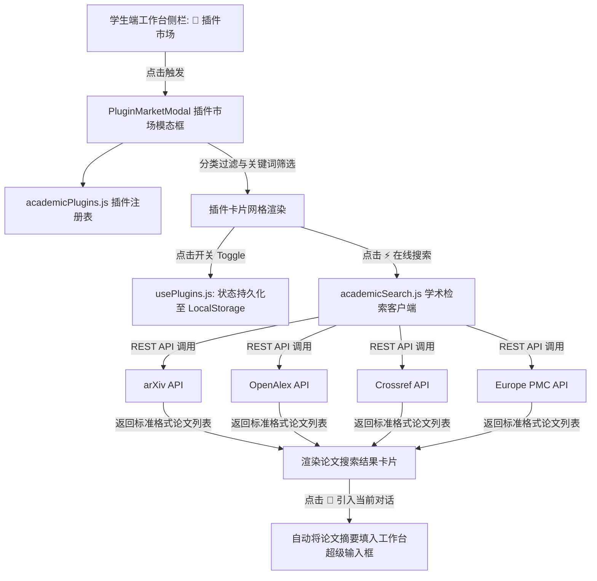

# 一站式 Work 插件市场与开源学术论文检索系统设计规范

## 1. 概述 (Overview)
为「一站式 Work」工作台打造专业级、可交互的 **插件市场（Plugin Marketplace）**。用户可点击侧栏的「🧩 插件市场」一键唤出沉浸式模态窗口，自由浏览、安装、开关多款权威开源学术论文检索插件与学术 Skills，并支持在插件市场内直接进行论文关键词实时检索、下载 PDF 及复制 BibTeX 引用。

---

## 2. 插件库与学术 Skills 清单 (Curated Open-Source Plugins)

| 插件标识 | 插件名称 | 类别 | 官方数据源 / API | 核心功能 |
| :--- | :--- | :--- | :--- | :--- |
| `plugin_arxiv` | **arXiv Paper Hunter** | 论文搜索 | arXiv REST API (`export.arxiv.org`) | CS/AI/物理等前沿预印本论文实时检索，支持抓取 PDF 与摘要 |
| `plugin_openalex` | **OpenAlex Global Scholar** | 论文搜索 | OpenAlex API (`api.openalex.org`) | 2.5 亿+ 全学科开放获取学术知识图谱，跨机构文献聚合 |
| `plugin_crossref` | **Crossref DOI Resolver** | 论文搜索 | Crossref API (`api.crossref.org`) | DOI 快速解析、学术期刊论文元数据校验、标准 BibTeX 导出 |
| `plugin_europepmc` | **Europe PMC Life Sciences** | 论文搜索 | Europe PMC API (`ebi.ac.uk/europepmc`) | 生物医学与生命科学文献、开源全文 XML/PDF 与临床证据 |
| `plugin_semanticscholar` | **Semantic Scholar Insight** | 学术 Skills | Semantic Scholar Graph API | AI 驱动的论文影响力分析、引用网络追踪与相关工作推荐 |
| `plugin_zotero` | **Zotero Knowledge Bridge** | 学术 Skills | Zotero API / Web Library | 学术资产关联、个人文献库同步与学术标签管理 |
| `plugin_peer_review` | **Academic Reviewer & Refiner**| 学术 Skills | 内置科研 Prompt 引擎 | 论文结构化精读、同行评审意见生成与学术英语润色 |
| `plugin_python_sandbox` | **Python Code Sandbox** | 研发工具 | Pyodide / 本地安全沙箱 | Python 算法执行、数学建模、数据科学脚本即时运行 |
| `plugin_chart_renderer` | **ECharts Visual Engine** | 数据图表 | Apache ECharts | 论文数据可视化、雷达图、折线图、网络拓扑图实时渲染 |

---

## 3. 用户交互与视觉设计 (UI/UX Design)

### 3.1 插件市场模态面板 (Marketplace Modal)
- **触发入口**：点击工作台左侧栏 `🧩 插件市场` 按钮平滑呼出。
- **视觉风格**：电影级玻璃拟态面板（`glass-panel-liquid` + 砂石白/深蓝点缀），圆角 `rounded-3xl`，轻量阴影 `shadow-2xl`。
- **顶部操作栏**：
  - 左侧：标题 `🧩 插件市场` + 副标题 `已挂载 9 款权威开源插件与学术 Skills`。
  - 中间：分类筛选 Tab（`🌟 全部`、`📄 论文搜索`、`🔬 学术 Skills`、`🛠️ 研发工具`、`📊 数据图表`）。
  - 右侧：关键词搜索框 + 关闭按钮（`Esc` 或右上角 `✕` 均可关闭）。
- **插件卡片网格 (Plugin Grid)**：
  - 卡片头部：精美渐变图标、插件名称、官方标签（如 `GitHub 开源`、`arXiv.org`、`v2.4.0`）。
  - 卡片中部：清晰简要的功能描述与能力特性 Tags（如 `#预印本` `#PDF直达` `#BibTeX导出`）。
  - 卡片底部：
    - **「⚡ 在线搜索/试用」按钮**（论文类插件）：呼出交互式检索面板。
    - **「启用/已安装」切换开关 (Toggle)**：控制该插件是否在当前 AI 工作台的问答流程中生效。

### 3.2 交互式学术检索面板 (Interactive Paper Search Drawer)
- 用户点击任意论文检索插件（如 arXiv / OpenAlex / Crossref）的「⚡ 在线试用」，即展开实时论文检索窗口。
- **输入框**：支持输入检索关键词（如 `DeepSeek`、`Transformer Attention`、`Knowledge Graph`）。
- **检索结果列表**：
  - 论文卡片：标题、发表年份、作者列表、所属机构/分类。
  - 论文摘要（支持展开/收起）。
  - **直达操作**：`📥 阅读/下载 PDF` 链接、`📋 复制 BibTeX` 引用、`💬 引入当前对话` 按钮。

---

## 4. 架构与数据流设计 (Architecture & Data Flow)

---

## 5. 验证与测试方案 (Verification Plan)
1. **单元与集成测试**：
   - 编写 `frontend/tests/pluginMarket.test.mjs` 测试插件注册表与元数据完整性。
   - 编写测试断言各 API 适配器数据映射与 BibTeX 格式生成。
2. **UI 交互验证**：
   - 点击侧栏「插件市场」流畅弹出。
   - Tab 切换（全部 / 论文搜索 / 学术 Skills 等）正常响应。
   - 搜索 arXiv / OpenAlex 论文成功返回并渲染。
   - 点击开关可正常更新已激活插件状态。
